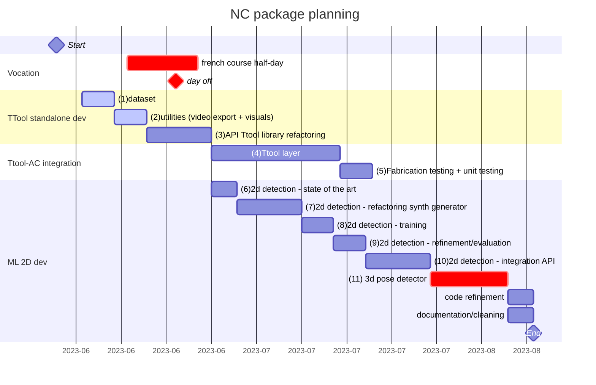
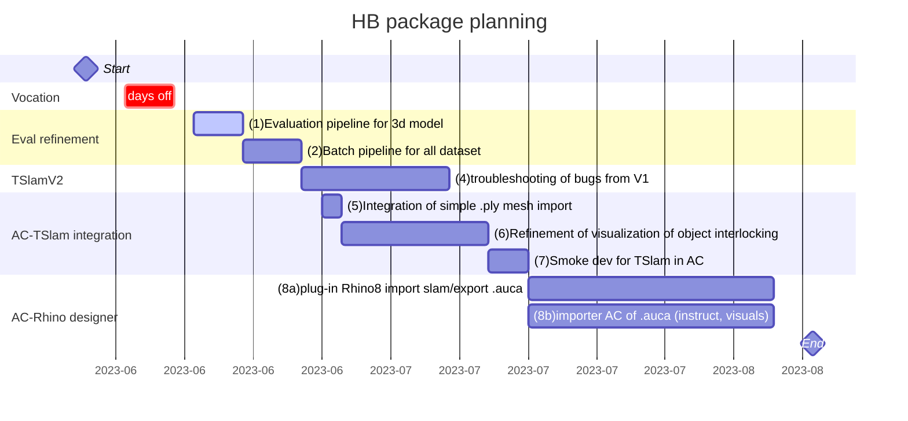

# Augmented Carpentry

[](https://github.com/ibois-epfl/augmented-carpentry)

<p>
    
</p>



## NC description working packages
- [ ] **(1) dataset**: the dataset needs to be finished and uploaded on zenodo. Here's the upcomong tasks:
  - [ ] chainsaw blade to scan
  - [ ] long drillb its (x2) to scan
  - [ ] refactor and reorder the dataset
  - [ ] add to the dataset: circular sawblade, saber sawblade, (optional) drillbit, check if it exists
  - [ ] refactor dataset nameing: <englishname>_<widthmm>_<lengthmm> (e.g. spadedrill_25_115)
  - [ ] integrate downloading procedures in AC and TTool

- [ ] **(2) utilities**: all utilities for the documentation of the developement needs to be implemented:
  - [ ] video recorder (with and without gui images)
  - [ ] camera pose output
  - [ ] log output with fabrication info

- [ ] **(3) API Ttool library refactoring**: the TTool needs to be refactored to an API. The executable should only use calls from the API. The API will be integrated to AC in the package later.

- [ ] **(4) Ttool layer**: in AC the tool header recognition needs to occupy a layer folling the AC structure and calls from the TTool API take place unikely there. It is possible that some level of multithreading (?) or corutine needs to be implemented to avoid bottlenecks in the main AC rander thread.

- [ ] **(5) Fabrication testing + unit testing**: the ttol layer in tegration in AC needs to be tested in fabrication scenario and features and modifications will be added following observations and quick user tests.

- [ ] **(6) 2d detection - state of the art**: some days will be reserved to an extensive review of the existing code that can be used in our application. Once the model identified it will be vet and discussed before starting the development.

- [ ] **(7-8-9-10) 2d detection - generator/training/refinement**: classical ML development for the custom training based on pre-existing synthetic data generator. The generator will need to be refacotered to add:
  - [ ] general simplifications
  - [ ] connection to the open-source dataset
  - [ ] procedural background images
  - [ ] procedural lighting
  - [ ] format output based on the chosen training format

- [ ] **(11) (optional) 3d pose detector**: if we are on time, 2 weeks will be reserved to the integration of a initial 6DOF pose detector to avoid the manual placing of the object.

---



## HB description working packages
- [ ] **(1) Evaluation pipeline for 3d model**: in the folder `eval\compute_model_metrics.py`, the script needs to evaluate the error in the reconstructed model from the tslam with its scanned ground truth. The stage for the working packages are the following:
  - [ ] clean out the gtg data in Rhino to reconstruct a perfect gt point cloud model
  - [ ] in the py script:
    - [ ] import gt model (*pcdGt*) and run the reconstruction for the dataset to obtain a `.ply` model
    - [ ] populate the tslam mesh model to obtain a pointcloud (*pcdTs*)
    - [ ] register and refine the realignement (e.g., umeyama + icp) of the two pcd
    - [ ] apply a Horn distance calculation to get the mean error
    - [ ] output a table + graph of the mean error (same style as the tslam evaluation)

- [ ] **(2) Batch pipeline for all dataset**: the entire evaluation for the tslam and model evaluation needs to be resumed in a `.sh` script that:
  - [ ] if it doesn't exist it downloads the zenodo dataset
  - [ ] run the compute of the pose, eval tracking and model for the entire dataset
  - [ ] (optional) it should be easy to be used on the machine downstairs and all the visualisations should be there

- [ ] **(3) Troubleshooting of bugs from V1**: the remaining bugs from the tslam should be investigate and troubleshooted to get to a v2 (e.g. drift away, mapping crashing and low speed, etc). If not all solved a list of the remaining bugs should be compiled.

- [ ] **(4) Integration of simple .ply mesh import**: integrate a general ply importer for tslam mesh.ply export to work on the correct visualization with the AC visualization geometry and rendering system.

- [ ] **(6) Refinement of visualization of object interlocking**: the alignment of the visualized object in the live feedback must be as perfect as possible. Investigate the quality and what we can improve (e.g. better calibration for the camera, etc)

- [ ] **(7) Smoke dev for TSlam in AC**: we have to be sure that the tslam is not breaking AC during fabrication and all the features of TSlam are integrated:
  - [ ] (optional) multi thread TSlam layer
  - [ ] implement a system that preven the fail of TSlam to shut down the entire AC
  - [ ] be sure that all the functionalities of TSlam have an interface (mapping, running, rebooting)
  - [ ] write a test for AC on a video turning min. 1h with tslam on.

- [ ] **(8a-b) Plug-in Rhino8 import slam/export .auca + importer AC of .auca (instruct, visuals)**: we need to build a plug in on Rhino to draw on the imported reconstruction of tslam and export them in the same transformation a file that reads all the metadata draw (planes and axis for cuts and drills) by the import of AC.

AR app is a linux desktop application containing a custom-made framework for augmented carpentry.

---

## TODOList
> - [ ] when we create the output yaml map we should not the calibration file and/or the camera model since this files is calibration-dependent

> - [ ] (*important*) vanilla tslam runs way smoother. We might have bottleneck in the AC software since we bleed frames. We should set a profiler and see where we can optimize.

> - [ ] create find package for TSlam instead install it locally
> - [ ] for the reporitories we roked in IBOIS for the gitsubmodules, be sure that nobody can do modifications

> - [ ] Design AC custom 3D file for import of execution 3D models (only points and lines)
> - [x] Add Mapping subprogram + UI
> - [x] Implement padding for 3D scene viewer
> - [x] Test if changing map on the go breaks the slam or not

> - [ ] Write a sub-program to calibrate the camera and export the correct format in xml

> - [ ] Find a way to sync SLAM maps and data
> - [x] Make the Camera of the viewport bigger

> - [ ] Add pop up program to calibrate camera

> - [ ] Double check if `Dloader.h` is working somewhere or need refactoring/suppression

> - [ ] Add `this->properties` as rule in contributing guide and refactor all the code

> - [x] Make the Camera of the viewport bigger (Defined in `Renderer.cpp:139`)

> - [x] Edit the readme for render API how to use it
> - [x] Refactor the Render part, put everything in one folder and extract/rename render API header.
> - [x] Add a function DrawCircle() to the RenderAPI
> - [x] Add a function DrawCylinder() to the RenderAPI
> - [x] Add a function DrawPolyline() to the RenderAPI
> - [x] Add a function DrawTriangle() to the RenderAPI
> - [x] Add a function DrawText() to the RenderAPI
> - [x] Fix the textRender, which is either not shown or overriding the scene
> - [ ] Cache objects in RenderAPI for speed up (option)


<br />

## Set touch monitor

The prototype is tested on a touch screen 7inch HDMI LCD (B) (WaveShare WS170120) and a laptop running Ubuntu 20/22.04 LTS. To config the touch screen on the pc follow ). Be sure to switch the display on, plug the mini-USB and finally plug the HDMI cable.

Set the display properties in the `config.ini` properties (to find them run the commands `xinput`  for the name and `xrandr` for the connection type).
```c++
[MonitorSpecs]
monitor_name = WaveShare WS170120
monitor_link_t = HDMI
monitor_resolution = 800x480
```
**You can build AS with the touch screen or on a non-touch screen.** To do so set ON or OFF the CMake option `DEPLOY_ON_TOUCH` in the `CMakeLists.txt`:

<br />

## STag PDFs
Stags are prepared in PDFs batches of ~150 stripes. You can find them [here](https://drive.google.com/drive/folders/1jic85gclymiV9014zc3tuUgIBq8lTyZr?usp=sharing).
They are made to be print as stickers. The code to generate them can be found .


<br />


## Build
Cloning the repo with submodules
```bash
git clone --recursive git@github.com:ibois-epfl/TSlam.git
```
or
```bash
git clone git@github.com:ibois-epfl/TSlam.git
git submodule sync
git pull --recurse-submodules
```

If it is the first time you are installing AC, set all the dependecies options in the `CMakeLists.txt` file to **ON**.

```bash
    ./configure.sh (or ./configure.sh -c for cleaning out the build folder)
    ./build.sh
```
To run the code:
```bash
./run.sh
```

## How to contribute
Please have a look at the `contributing.md" file. There you will find all the set of rules and the main softwarer documentation to contribute.
