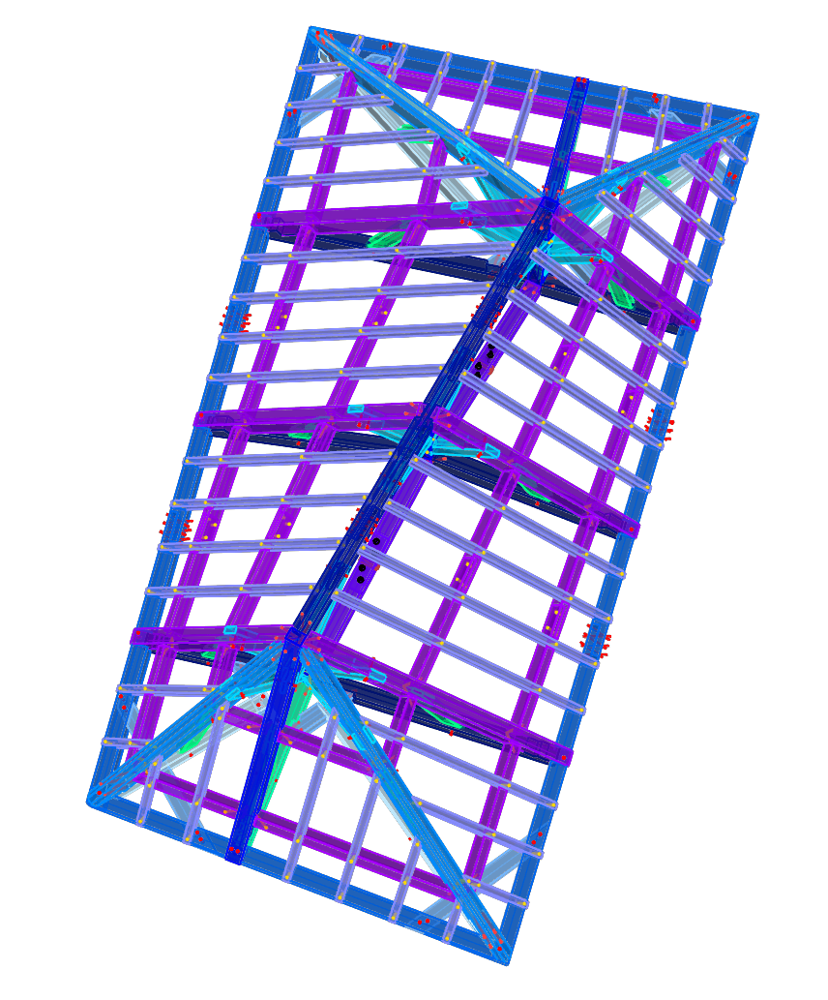

<p align="center">
    
</p>
<p align="center">
    
</p>


# Augmented Carpentry

## Roof prototype
The first structure is a a typical roof parametrized and modified to complexify the fabrication. The optimization of the structure was meant to obtain a structure where each element is unique either by length, angle or shape. The goal was to demonstrate the utility of the technology in a manufacturing a complex structure without the need of 2D drawings or marking on the timber pieces.

<p align="center">
    
    
</p>

```
0. Timber bill for AC prototype
Catalog: https://www.getaz-miauton.ch/fileadmin/CrhOneInternet/user_upload/2022-03-02_Massivholz_SR-FR_2022.pdf

section: 0.2,0.14 m / serial number: 61201420 / Total linear length: 123.83 m
section: 0.14,0.08 m / serial number: 7925785 / Total linear length: 64.86 m
section: 0.14,0.14 m / serial number: 61201414 / Total linear length: 24.26 m
section: 0.08,0.06 m / serial number: 61130607 / Total linear length: 94.89 m

```


---

## TODOList
> - [ ] the change of the calibration file brakes the tslam (but not the ttool it seems)
> - [ ] when we create the output yaml map we should not the calibration file and/or the camera model since this files is calibration-dependent
> - [ ] create find package for TSlam instead install it locally
> - [ ] for the reporitories we roked in IBOIS for the gitsubmodules, be sure that nobody can do modifications

> - [ ] Design AC custom 3D file for import of execution 3D models (only points and lines)
> - [x] Add Mapping subprogram + UI
> - [x] Implement padding for 3D scene viewer
> - [x] Test if changing map on the go breaks the slam or not

> - [ ] (*important*) vanilla tslam runs way smoother. We might have bottleneck in the AC software since we bleed frames. We should set a profiler and see where we can optimize.

> - [ ] create find package for TSlam instead install it locally
> - [ ] for the reporitories we roked in IBOIS for the gitsubmodules, be sure that nobody can do modifications

> - [ ] Design AC custom 3D file for import of execution 3D models (only points and lines)

[//]: # (> - [x] Add Mapping subprogram + UI)
[//]: # (> - [x] Implement padding for 3D scene viewer)
[//]: # (> - [x] Test if changing map on the go breaks the slam or not)

[//]: # (> - [x] Write a sub-program to calibrate the camera and export the correct format in xml)

> - [ ] Find a way to sync SLAM maps and data

[//]: # (> - [x] Make the Camera of the viewport bigger)

[//]: # (> - [x] Add pop up program to calibrate camera)

> - [ ] Double check if `Dloader.h` is working somewhere or need refactoring/suppression

> - [ ] Double check if `Dloader.h` is working somewhere or need refactoring/suppression

> - [ ] Add `this->properties` as rule in contributing guide and refactor all the code

[//]: # (> - [x] Make the Camera of the viewport bigger &#40;Defined in `Renderer.cpp:139`&#41;)

[//]: # (> - [x] Edit the readme for render API how to use it)
[//]: # (> - [x] Refactor the Render part, put everything in one folder and extract/rename render API header.)
[//]: # (> - [x] Add a function DrawCircle&#40;&#41; to the RenderAPI)
[//]: # (> - [x] Add a function DrawCylinder&#40;&#41; to the RenderAPI)
[//]: # (> - [x] Add a function DrawPolyline&#40;&#41; to the RenderAPI)
[//]: # (> - [x] Add a function DrawTriangle&#40;&#41; to the RenderAPI)
[//]: # (> - [x] Add a function DrawText&#40;&#41; to the RenderAPI)
[//]: # (> - [x] Fix the textRender, which is either not shown or overriding the scene)
> - [ ] Cache objects in RenderAPI for speed up (option)

[//]: # (> - [x] We have to check &#40;or at least catch&#41; the error that may occur due to the incompatible camera parameter and SLAM map after camera calibration.)
[//]: # (> - [x] Undistort Camera view)
> - [ ] Bug when selecting path & filename to "save" (can't type)
> - [ ] Make the viewport size a config (now is fixed in the code)

> - [ ] Load Mesh from UI

> - [ ] VideoRecorder: Implement handling for starting a new video while the previous one is still in the processing phase.
> - [ ] VideoRecorder: Button color for pressed and unpressed states.
> - [ ] VideoRecorder: Reduce video file size.

## Set touch monitor

The prototype is tested on a touch screen 7inch HDMI LCD (B) (WaveShare WS170120) and a laptop running Ubuntu 20/22.04 LTS. To config the touch screen on the pc follow [these steps first](https://www.waveshare.com/wiki/7inch_HDMI_LCD). Be sure to switch the display on, plug the mini-USB and finally plug the HDMI cable.

Set the display properties in the `config.ini` properties (to find them run the commands `xinput`  for the name and `xrandr` for the connection type).

The following specs works on the X11 display server. If you are using wayland and wanting to switch to X11 follow [this link](https://helpdesk.psionline.com/hc/en-gb/articles/13470827149332-How-to-perform-the-switch-from-the-Wayland-display-server-to-Xorg-X11-on-Linux-Ubuntu-22-04-LTS)
./
```c++
[MonitorSpecs]
monitor_name = WaveShare WS170120
monitor_link_t = HDMI
monitor_resolution = 800x480
```
For wayland display server. WARNING: Wayland display and touchscreen are not compatible yet as the touchscreen register for the main display and not the small display.
```c++
[MonitorSpecs]
LinkMode = XWAYLAND1
Name = Virtual core pointer
Resolution = 800x480
```
**You can build AS with the touch screen or on a non-touch screen.** To do so set ON or OFF the CMake option `DEPLOY_ON_TOUCH` in the `CMakeLists.txt`:

<br />

## STag PDFs
Stags are prepared in PDFs batches of ~150 stripes. You can find them [here](https://drive.google.com/drive/folders/1jic85gclymiV9014zc3tuUgIBq8lTyZr?usp=sharing).
They are made to be print as stickers. The code to generate them can be found .


<br />


## System dependecies
AC needs some local libraries already installed before compilation with cmake. 

Before start you will need many dependencies but the largest will be opencv `4.5.5`. Be sure to have installed this version in your local system.

Next we need glm dependencies and libraries:
```bash
sudo apt-get -y install libmpfr-dev libboost-dev libgoogle-glog-dev \
                        freeglut3-dev libglew-dev libglfw3 libglfw3-dev \
                        git-lfs libassimp-dev libglm-dev libimgui-dev
```

For tbb and opencv you will also need these:
```bash
sudo apt -y install build-essential cmake git pkg-config libgtk-3-dev \
    libavcodec-dev libavformat-dev libswscale-dev libv4l-dev \
    libxvidcore-dev libx264-dev libjpeg-dev libpng-dev libtiff-dev \
    gfortran openexr libatlas-base-dev python3-dev python3-numpy \
    libtbb2 libtbb-dev libdc1394-dev libopenexr-dev \
    libgstreamer-plugins-base1.0-dev libgstreamer1.0-dev 
```
For the video recorder you will need opencv too and ffmpeg
```bash
sudo apt -y install ffmpeg
```

```bash
## Build & run
Cloning the repo with submodules
```bash
git clone --recursive git@github.com:ibois-epfl/augmented-carpentry.git
```
or
```bash
git clone git@github.com:ibois-epfl/augmented-carpentry.git
git submodule sync
git pull --recurse-submodules
```

Next you need to pull the PyTorch dependency with the Large File System in git, to do this:
```bash
cd deps/TTool
git lfs pull
```

Time to build.. If you are deploying on a touch monitor set the flag `-DDEPLOY_ON_TOUCH=ON`, you can config:

```bash
cd augmented-carpentry
cmake -S . -B build
cmake --build build
```

To run the code:
```bash
./build/bin/AC
```

## How to contribute
Please have a look at the `contributing.md" file. There you will find all the set of rules and the main softwarer documentation to contribute.
