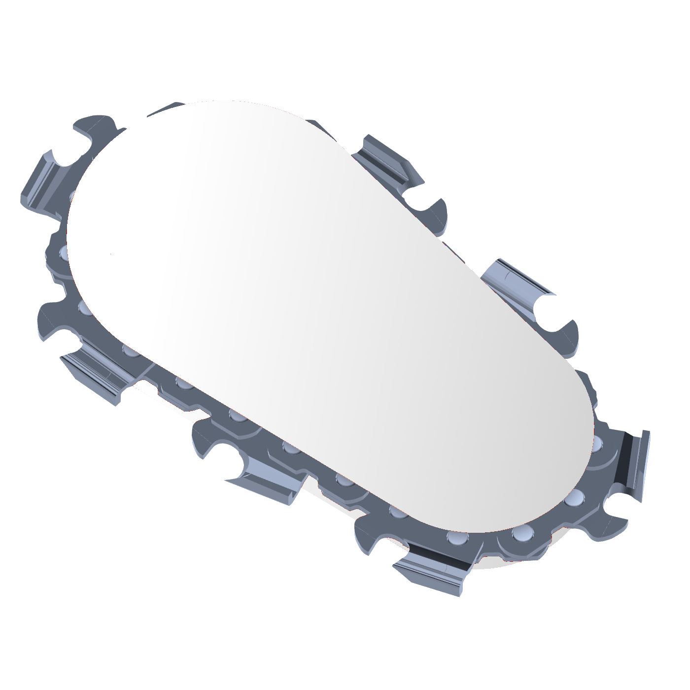

<p align="center">
    
</p>
<p align="center">
    
    
    
</p>


# Augmented Carpentry

Donwnload the repo first:
```bash
git clone https://github.com/ibois-epfl/augmented-carpentry.git
git submodule sync
git pull --recurse-submodules
```

## System dependecies
AC needs some local libraries already installed before compilation with cmake. 

Before start you will need many dependencies but the largest will be opencv `4.5.5`. Be sure to have installed this version in your local system.

Next we need glm dependencies and libraries:
```bash
sudo apt-get -y install libmpfr-dev libboost-dev libgoogle-glog-dev \
                        freeglut3-dev libglew-dev libglfw3 libglfw3-dev \
                        git-lfs libassimp-dev libglm-dev libimgui-dev \
                        libcgal-dev
```

For tbb and opencv you will also need these:
```bash
sudo apt -y install build-essential cmake git pkg-config libgtk-3-dev \
    libavcodec-dev libavformat-dev libswscale-dev libv4l-dev \
    libxvidcore-dev libx264-dev libjpeg-dev libpng-dev libtiff-dev \
    gfortran openexr libatlas-base-dev python3-dev python3-numpy \
    libtbb2 libtbb-dev libdc1394-dev libopenexr-dev \
    libgstreamer-plugins-base1.0-dev libgstreamer1.0-dev 
```
For the video recorder you will need opencv too and ffmpeg
```bash
sudo apt -y install ffmpeg
```

Next you need to pull the PyTorch dependency with the Large File System in git, to do this:
```bash
cd deps/TTool
git lfs pull
```

## Build

Time to build.. If you are deploying on a touch monitor set the flag `-DDEPLOY_ON_TOUCH=ON`, you can config:

```bash
cd augmented-carpentry
cmake -S . -B build
cmake --build build
```

To run the code:
```bash
./build/bin/AC
```

## Set touch monitor

The prototype is tested on a touch screen 7inch HDMI LCD (B) (WaveShare WS170120) and a laptop running Ubuntu 20/22.04 LTS. To config the touch screen on the pc follow [these steps first](https://www.waveshare.com/wiki/7inch_HDMI_LCD). Be sure to switch the display on, plug the mini-USB and finally plug the HDMI cable.

Set the display properties in the `config.ini` properties (to find them run the commands `xinput`  for the name and `xrandr` for the connection type).

The following specs works on the X11 display server. If you are using wayland and wanting to switch to X11 follow [this link](https://helpdesk.psionline.com/hc/en-gb/articles/13470827149332-How-to-perform-the-switch-from-the-Wayland-display-server-to-Xorg-X11-on-Linux-Ubuntu-22-04-LTS)
./

```c++
[MonitorSpecs]
monitor_name = WaveShare WS170120
monitor_link_t = HDMI
monitor_resolution = 800x480
```

For wayland display server. WARNING: Wayland display and touchscreen are not compatible yet as the touchscreen register for the main display and not the small display.

```c++
[MonitorSpecs]
LinkMode = XWAYLAND1
Name = Virtual core pointer
Resolution = 800x480
```

> You can build AC with the touch screen or on a non-touch screen. To do so set ON or OFF the CMake option `DEPLOY_ON_TOUCH` in the `CMakeLists.txt`:

<br />

## STag PDFs
Stags are prepared in PDFs batches of ~150 stripes. You can find them [here](https://drive.google.com/drive/folders/1jic85gclymiV9014zc3tuUgIBq8lTyZr?usp=sharing).
They are made to be print as stickers. The code to generate them can be found .

