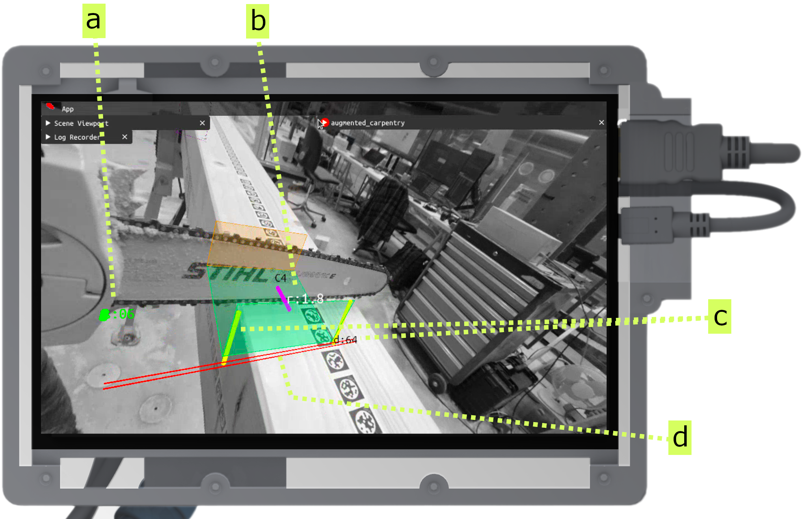
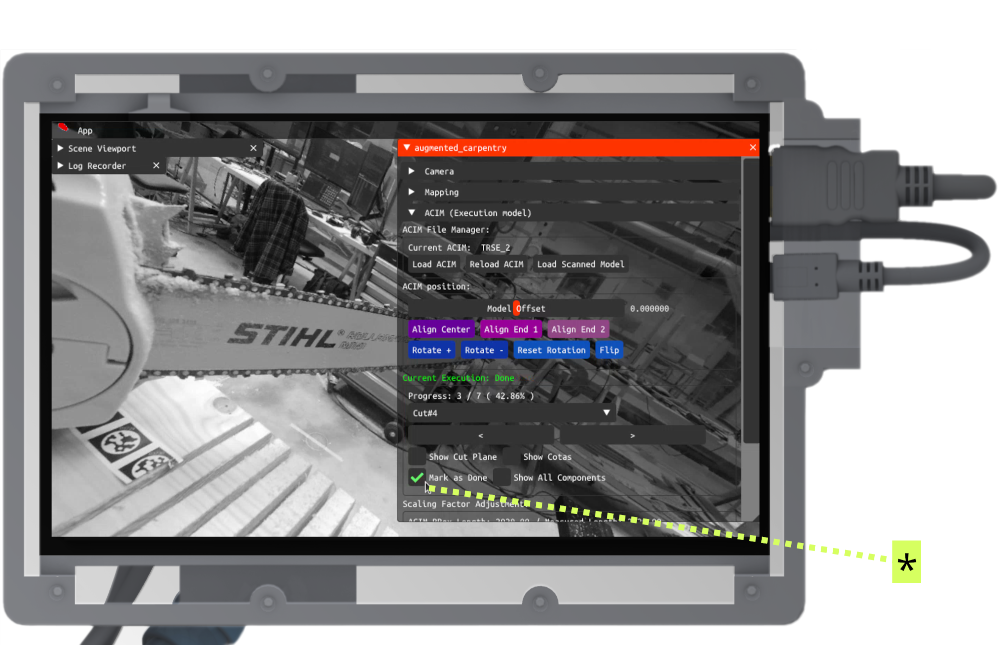
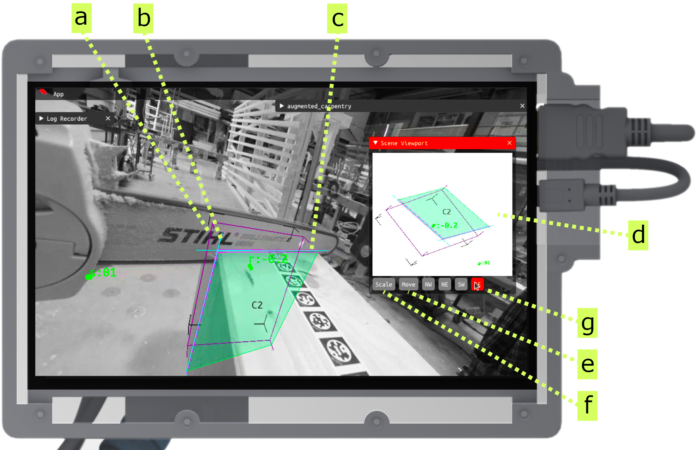

---
tags:
  - acim
  - UI
  - cut
  - chainsaw-blade
  - fab
---

Here's the step-by-step guide on how to use augmented-carpentry with any circular saw to realize basic woodworking operations.

<iframe src="https://player.vimeo.com/video/1068850648?h=c7dce822c4&amp;badge=0&amp;autopause=0&amp;title=0&amp;player_id=0&amp;app_id=58479" frameborder="0" allow="autoplay; fullscreen; picture-in-picture; clipboard-write; encrypted-media" style="position:absolute;top:0;left:0;width:100%;height:100%;"></iframe>

 

# Step-by-step

<!-- Intro to UI and feedback components (pos, rot, depth) -->

<figure markdown>

</figure>

The assistance interface for the chainsaw is composed by the following elements:

**a** - Feedback for balde position (in cm). The goal is to diminish the line length corresponding to the position error, to zero (green).

**b** - Feedback for blade rotation (in degrees). The goal is to diminish the line length corresponding to the angle error, to zero (green).

**c** - This is particular to the chainsaw feedback system. In order to obtain straight cuts both the base and tip of the chain needs to have equal heights. The yellow lines represent the distance to the bottom faces of bottom and tip blade. The idea is to have equidistant heights so that the two lines become green. The value `d:00` represents the shortest distances of both.

**d** - The blade projection on the bottom face.

<!-- Position: placing blade -->

<figure markdown>

    <iframe 
        src="https://player.vimeo.com/video/1068875476?h=f7f93dcf44&amp;background=1&amp;autopause=0&amp;loop=1&amp;autoplay=1&amp;muted=1&amp;controls=0&amp;title=0&amp;byline=0&amp;portrait=0" 
        frameborder="0" 
        allow="autoplay; fullscreen; picture-in-picture" 
        allowfullscreen>
    </iframe>
    
    

</figure>

Adjust now the position (**a**) until the indicator becomes green.

<!-- Rotation: rotate blade -->

<figure markdown>

    <iframe 
        src="https://player.vimeo.com/video/1068880690?h=95fec4aad5&amp;background=1&amp;autopause=0&amp;loop=1&amp;autoplay=1&amp;muted=1&amp;controls=0&amp;title=0&amp;byline=0&amp;portrait=0" 
        frameborder="0" 
        allow="autoplay; fullscreen; picture-in-picture" 
        allowfullscreen>
    </iframe>
    
    

</figure>

Adjust now the rotation (**b**) until the indicator becomes green.

<!-- Depth: adjust blade while cutting-->

<figure markdown>

    <iframe 
        src="https://player.vimeo.com/video/1068890700?h=aae78228dc&amp;background=1&amp;autopause=0&amp;loop=1&amp;autoplay=1&amp;muted=1&amp;controls=0&amp;title=0&amp;byline=0&amp;portrait=0" 
        frameborder="0" 
        allow="autoplay; fullscreen; picture-in-picture" 
        allowfullscreen>
    </iframe>
    
    

</figure>

You can now start the cut. Adjust the two ends (**c**) so that the blade is straight. Watch out the `d:00` when it gets to zero, the cut is done.

<!-- Do the second cut and fill the cuts in the middle, and set as done -->

<figure markdown>

    <iframe 
        src="https://player.vimeo.com/video/1068897985?h=3b964c7200&amp;player_id=0&amp;app_id=58479&amp;byline=0&amp;portrait=0" 
        frameborder="0" 
        allow="autoplay; fullscreen; picture-in-picture" 
        allowfullscreen>
    </iframe>
    

</figure>

Now you can do the other side of the cut and the multiple cuts in between the two ends without augmented feedback.

<!-- Clean and inspect the full cut -->

<figure markdown>

    <iframe 
        src="https://player.vimeo.com/video/1068899592?h=3e8f0602ee&amp;loop=1&amp;autoplay=1&amp;muted=1&amp;controls=0&amp;title=0&amp;byline=0&amp;portrait=0" 
        frameborder="0" 
        allow="autoplay; fullscreen; picture-in-picture" 
        allowfullscreen>
    </iframe>
    

</figure>

Once done, you can inspect the full cut with the augmented overlay.

<!-- Set as done the current joint -->

<figure markdown>

</figure>

Once you are done hit the button **Done** to set the joint as done (*).

<!-- hint: example of single end cut -->
!!! cut-joint "Butt joint"
    

    <figure markdown>
    
    </figure>
    

    For end half-lap joints, the feedback elements are the same as for cross-lap joints. The difference is that the blade will be guided to the end of the cut, and the cut will be done only on one side of the timber.

    **a** - bounding box boundaries

    **b** - chainsaw blade's axis

    **c** - chainsaw blade's thickness

    **d** - joint 3D visualization. This can be particularly useful for having a better understanding of the joint's geometry and the blade's position during the cut.

    **e** - move the 3D view

    **f** - zoom the 3D view

    **g** - selected fix orthographic view
    

    

    

    <figure markdown>
    

        <iframe 
            src="https://player.vimeo.com/video/1068903814?h=b4005903e1&amp;player_id=0&amp;app_id=58479&amp;byline=0&amp;portrait=0" 
            frameborder="0" 
            allow="autoplay; fullscreen; picture-in-picture" 
            allowfullscreen>
        </iframe>
        
    

    </figure>
    

    The system guides you to the end of the single one-face cut. Make sure to keep the position and rotation values green all along.
    

    

!!! danger "Double inclined cuts"
    

    <figure markdown>
    

        <iframe 
            src="https://player.vimeo.com/video/1068924530?h=01b80be6ce&amp;player_id=0&amp;app_id=58479&amp;byline=0&amp;portrait=0" 
            frameborder="0" 
            allow="autoplay; fullscreen; picture-in-picture" 
            allowfullscreen>
        </iframe>
        
    

    </figure>
    

    For double inclined cuts, the rotation feedback will not guide all degrees of freedom. The two degrees of freedom for the rotation will be merged into the same feedback. React intuitivly to the feedback and adjust the rotation until the indicator becomes green.
    

    

     