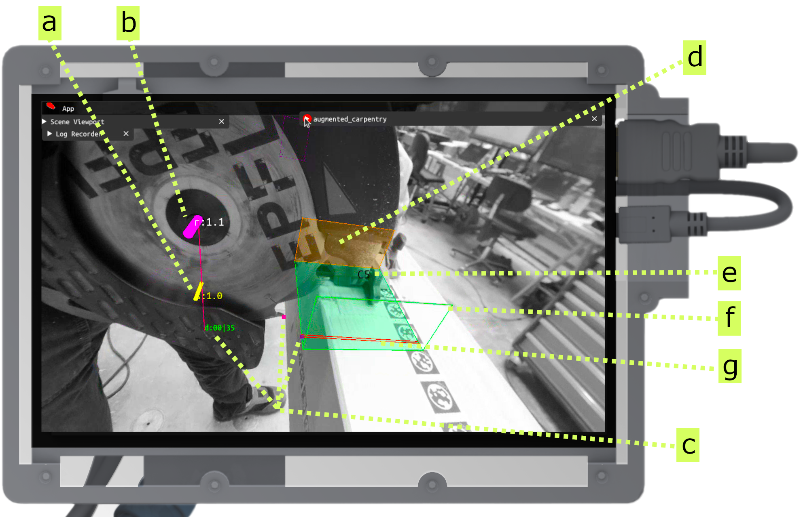
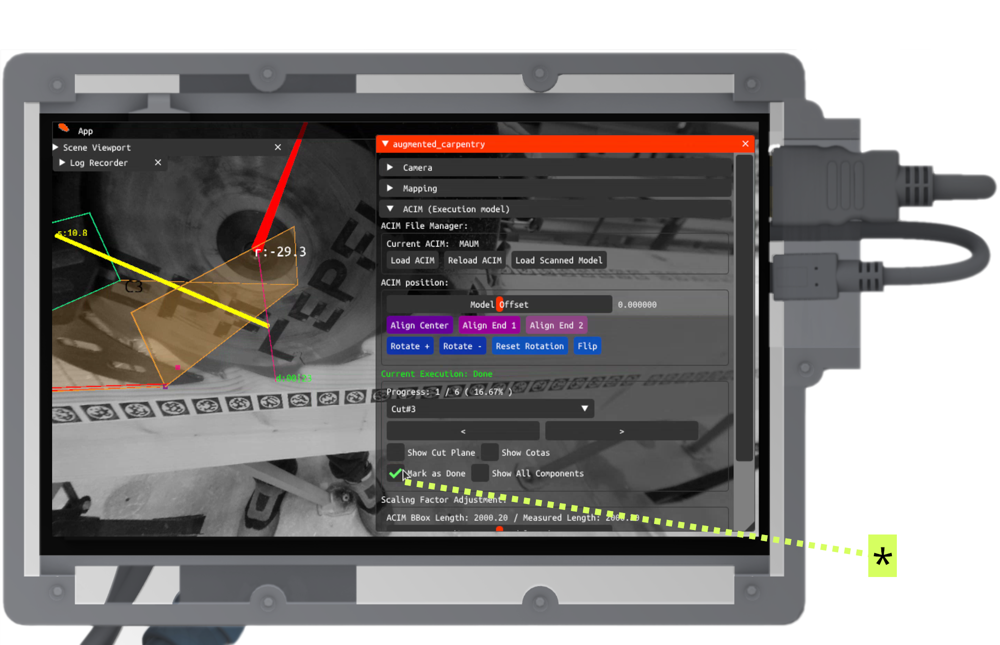
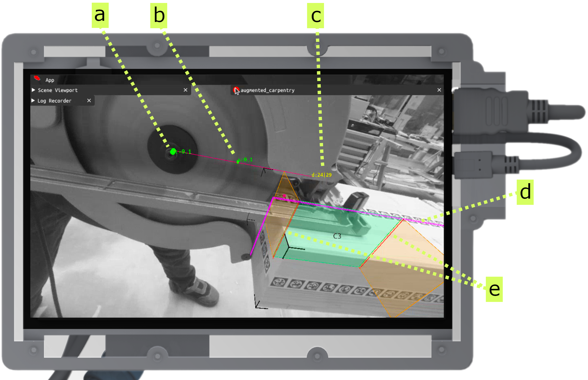

---
tags:
  - acim
  - UI
  - cut
  - circular-blade
  - fab
---

Here's the step-by-step guide on how to use augmented-carpentry with any circular saw to realize basic joints (cross-lap, half-lap, and butt joints).

<iframe src="https://player.vimeo.com/video/1068168766?h=51370fb4a5&amp;badge=0&amp;autopause=0&amp;title=0&amp;player_id=0&amp;app_id=58479" frameborder="0" allow="autoplay; fullscreen; picture-in-picture; clipboard-write; encrypted-media" style="position:absolute;top:0;left:0;width:100%;height:100%;"></iframe>

 

# Step-by-step

<!-- Intro to UI and feedback components (pos, rot, depth) -->

<figure markdown>

</figure>

This is the overview of the feedback and widget system to assist you during the cut.

**a** - Feedback for balde position (in cm). The goal is to diminish the line length corresponding to the position error, to zero (green).

**b** - Feedback for blade rotation (in degrees). The goal is to diminish the line length corresponding to the angle error, to zero (green).

**c** - Feedback for balde depth (in mm). The goal is to to get to a value close to zero (green). In `00|00`, the first tow digit represent the distance of the projected blade to the bottom face of the cut, and the last two digits represent the closest distance from the blade to the bottom face of the cut (two purple-magenta points).

**d** - Unselected face.

**e** - The current label name of the cut.

**f** - Auto-selected face to be cut. Face is auto-selected based on the blade position and orientation.

**g** - Projection of the blade thickness on the face to be cut.

<!-- Depth: adjust blade -->

<figure markdown>

    <iframe 
        src="https://player.vimeo.com/video/1067794618?h=ce5466e413&amp;background=1&amp;autopause=0&amp;loop=1&amp;autoplay=1&amp;muted=1&amp;controls=0&amp;title=0&amp;byline=0&amp;portrait=0" 
        frameborder="0" 
        allow="autoplay; fullscreen; picture-in-picture" 
        allowfullscreen>
    </iframe>
    
    

</figure>

Adjust first the height of the blade (**c**) until the indicator becomes green.

<!-- Position: placing blade -->

<figure markdown>

    <iframe 
        src="https://player.vimeo.com/video/1067814264?h=98b3b28664&amp;background=1&amp;autopause=0&amp;loop=1&amp;autoplay=1&amp;muted=1&amp;controls=0&amp;title=0&amp;byline=0&amp;portrait=0" 
        frameborder="0" 
        allow="autoplay; fullscreen; picture-in-picture" 
        allowfullscreen>
    </iframe>
    
    

</figure>

Adjust now the position (**a**) until the indicator becomes green.

<!-- Rotation: rotate blade -->

<figure markdown>

    <iframe 
        src="https://player.vimeo.com/video/1068047212?h=d8411fd54a&amp;background=1&amp;autopause=0&amp;loop=1&amp;autoplay=1&amp;muted=1&amp;controls=0&amp;title=0&amp;byline=0&amp;portrait=0" 
        frameborder="0" 
        allow="autoplay; fullscreen; picture-in-picture" 
        allowfullscreen>
    </iframe>
    
    

</figure>

Adjust now the rotation (**b**) until the indicator becomes green.

<!-- Guide the cut towards the end -->

<figure markdown>

    <iframe 
        src="https://player.vimeo.com/video/1068057601?h=7c21104e9a&amp;player_id=0&amp;app_id=58479&amp;byline=0&amp;portrait=0" 
        frameborder="0" 
        allow="autoplay; fullscreen; picture-in-picture" 
        allowfullscreen>
    </iframe>
    

</figure>

Now you can start cutting. During the cut make sure to keep the position and rotation values green, and push through the end of the cut.

<!-- Quick inspection to see the overlap -->

<figure markdown>

    <iframe 
        src="https://player.vimeo.com/video/1068064840?h=83023d1fce&amp;loop=1&amp;autoplay=1&amp;muted=1&amp;controls=0&amp;title=0&amp;byline=0&amp;portrait=0" 
        frameborder="0" 
        allow="autoplay; fullscreen; picture-in-picture" 
        allowfullscreen>
    </iframe>
    

</figure>

Now you can start cutting. During the cut make sure to keep the position and rotation values green, and push through the end of the cut.

<!-- Do the second cut and fill the cuts in the middle -->

<figure markdown>

    <iframe 
        src="https://player.vimeo.com/video/1068068123?h=3628e00d4f&amp;player_id=0&amp;app_id=58479&amp;byline=0&amp;portrait=0" 
        frameborder="0" 
        allow="autoplay; fullscreen; picture-in-picture" 
        allowfullscreen>
    </iframe>
    

</figure>

Now you can do the other side of the cut. Make sure to keep the position and rotation values green, and push through the end of the cut as the first one. Now you can do multiple cuts in between the two ends without augmented feedback.

<!-- Set as done the current cut -->

<figure markdown>

</figure>

Once you are done hit the button **Done** to set the cut as done (*).

<!-- Clean and inspect the full cut -->

<figure markdown>

    <iframe 
        src="https://player.vimeo.com/video/1068101421?h=b6c3fb9e63&amp;loop=1&amp;autoplay=1&amp;muted=1&amp;controls=0&amp;title=0&amp;byline=0&amp;portrait=0" 
        frameborder="0" 
        allow="autoplay; fullscreen; picture-in-picture" 
        allowfullscreen>
    </iframe>
    

</figure>

Once you cleaned out the joint, you can inspect the full cut with the augmented overlay.

<!-- TODO: hint: example of single end cut -->
!!! cut-joint "End half-lap joints"
    

    <figure markdown>
    
    </figure>
    

    For end half-lap joints, the feedback elements are the same as for cross-lap joints. The difference is that the blade will be guided to the end of the cut, and the cut will be done only on one side of the timber.

    **a** - position feedback (see above)

    **b** - rotation feedback (see above)

    **c** - `00|00` (as above). For this specific cut, follow the last two digits representing the closest distance from the blade to the bottom face of the cut (two purple-magenta points).

    **d** - intersection of the blade with the timber element.

    **e** - blade thickness projection to the closest and bottom face of the half-lap joint.
    

    

    

    <figure markdown>
    

        <iframe 
            src="https://player.vimeo.com/video/1068143813?h=5805d231d5&amp;player_id=0&amp;app_id=58479&amp;byline=0&amp;portrait=0" 
            frameborder="0" 
            allow="autoplay; fullscreen; picture-in-picture" 
            allowfullscreen>
        </iframe>
        
    

    </figure>
    

    The system guides you to the end of the cut. Make sure to keep the position and rotation values green, and stop when the depth value touches 0 (the blade is now touching the opposite face).
    

    

!!! danger "Double inclined cuts"
    

    <figure markdown>
    

        <iframe 
            src="https://player.vimeo.com/video/1068115543?h=4945e573d7&amp;player_id=0&amp;app_id=58479&amp;byline=0&amp;portrait=0" 
            frameborder="0" 
            allow="autoplay; fullscreen; picture-in-picture" 
            allowfullscreen>
        </iframe>
        
    

    </figure>
    

    For double inclined cuts, the rotation feedback will not guide all degrees of freedom. The two degrees of freedom for the rotation will be merged into the same feedback. React intuitivly to the feedback and adjust the rotation until the indicator becomes green.
    

    

     