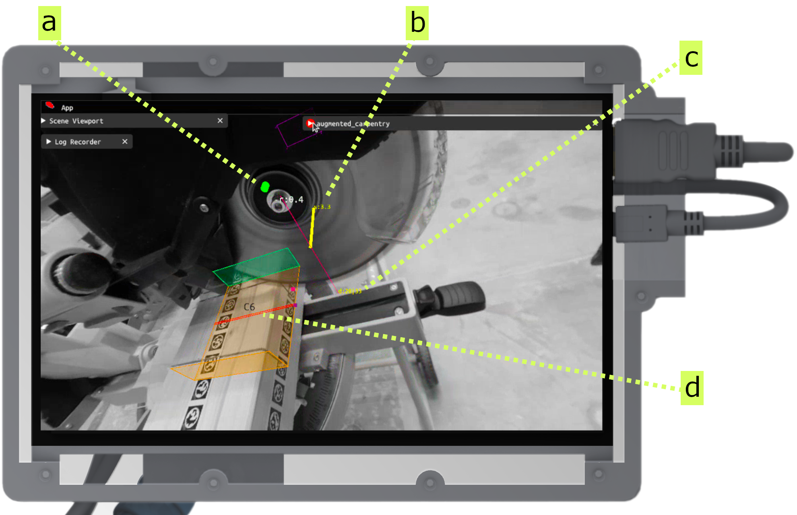
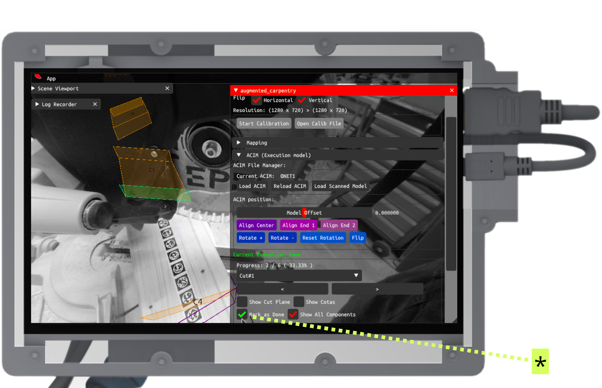
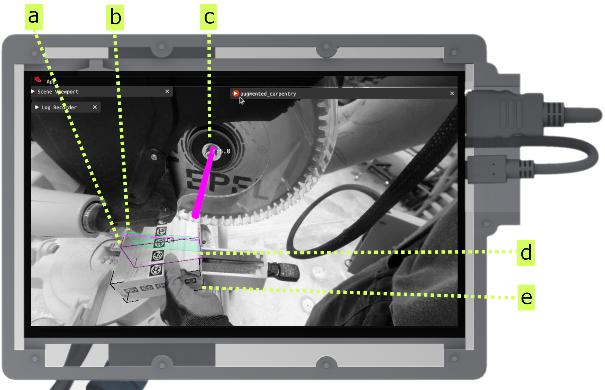

---
tags:
  - acim
  - UI
  - cut
  - circular-blade
  - fab
---

Here's the step-by-step guide on how to use augmented-carpentry with any miter saw to realize basic joints (cross-lap, half-lap, and butt joints). The guidance system is similar to the one for [circular saws](augmented-circular-saw.md).

<iframe src="https://player.vimeo.com/video/1069137536?h=eb40e565bc&amp;badge=0&amp;autopause=0&amp;title=0&amp;player_id=0&amp;app_id=58479" frameborder="0" allow="autoplay; fullscreen; picture-in-picture; clipboard-write; encrypted-media" style="position:absolute;top:0;left:0;width:100%;height:100%;"></iframe>

 

# Step-by-step

<!-- Intro to UI and feedback components (pos, rot, depth) -->

<figure markdown>

</figure>

This is the overview of the feedback and widget system to assist you during the cut.

**a** - Feedback for balde position (in cm). The goal is to diminish the line length corresponding to the position error, to zero (green).

**b** - Feedback for blade rotation (in degrees). The goal is to diminish the line length corresponding to the angle error, to zero (green).

**c** - Feedback for balde depth (in mm). The goal is to to get to a value close to zero (green). In `00|00`, the first tow digit represent the distance of the projected blade to the bottom face of the cut, and the last two digits represent the closest distance from the blade to the bottom face of the cut (two purple-magenta points).

**d** - Projection of the blade thickness on the face to be cut.

<!-- Rotation: rotate blade -->

<figure markdown>

    <iframe 
        src="https://player.vimeo.com/video/1069143962?h=2fbeababdf&amp;background=1&amp;autopause=0&amp;loop=1&amp;autoplay=1&amp;muted=1&amp;controls=0&amp;title=0&amp;byline=0&amp;portrait=0" 
        frameborder="0" 
        allow="autoplay; fullscreen; picture-in-picture" 
        allowfullscreen>
    </iframe>
    
    

</figure>

Adjust the rotation (**b**) until the indicator becomes green.

<!-- Position: placing blade -->

<figure markdown>

    <iframe 
        src="https://player.vimeo.com/video/1069145307?h=e4cbec299a&amp;background=1&amp;autopause=0&amp;loop=1&amp;autoplay=1&amp;muted=1&amp;controls=0&amp;title=0&amp;byline=0&amp;portrait=0" 
        frameborder="0" 
        allow="autoplay; fullscreen; picture-in-picture" 
        allowfullscreen>
    </iframe>
    
    

</figure>

Adjust now the position (**a**) until the indicator becomes green.

<!-- Depth: adjust blade -->

<figure markdown>

    <iframe 
        src="https://player.vimeo.com/video/1069151977?h=b8edaab81f&amp;background=1&amp;autopause=0&amp;loop=1&amp;autoplay=1&amp;muted=1&amp;controls=0&amp;title=0&amp;byline=0&amp;portrait=0" 
        frameborder="0" 
        allow="autoplay; fullscreen; picture-in-picture" 
        allowfullscreen>
    </iframe>
    
    

</figure>

With miter saws the adjustement of the depth can be done on the go. Lower the blade and stop to the right height (**d** `00|00` first value is 0).

<!-- Guide the cut towards the end -->

<figure markdown>

    <iframe 
        src="https://player.vimeo.com/video/1069155866?h=a93c4887d4&amp;background=1&amp;autopause=0&amp;loop=1&amp;autoplay=1&amp;muted=1&amp;controls=0&amp;title=0&amp;byline=0&amp;portrait=0"
        frameborder="0" 
        allow="autoplay; fullscreen; picture-in-picture" 
        allowfullscreen>
    </iframe>
    

</figure>

Push through the end of the cut. With the miter saw it is easier than the [circular saw](augmented-circular-saw.md) since you have a mechanical fixed guide.

<!-- Do the second cut and fill the cuts in the middle -->

<figure markdown>

    <iframe 
        src="https://player.vimeo.com/video/1069157914?h=3efa55f426&amp;player_id=0&amp;app_id=58479&amp;byline=0&amp;portrait=0" 
        frameborder="0" 
        allow="autoplay; fullscreen; picture-in-picture" 
        allowfullscreen>
    </iframe>
    

</figure>

As for the [circular saw](augmented-circular-saw.md), do the second cut and slots of the joints.

<!-- Guide the cut towards the end -->

<figure markdown>

    <iframe 
        src="https://player.vimeo.com/video/1069165455?h=a7509580fd&amp;background=1&amp;autopause=0&amp;loop=1&amp;autoplay=1&amp;muted=1&amp;controls=0&amp;title=0&amp;byline=0&amp;portrait=0"
        frameborder="0" 
        allow="autoplay; fullscreen; picture-in-picture" 
        allowfullscreen>
    </iframe>
    

</figure>

You can inspect the cuts if the overlay matches the cut. If not, you can adjust the cut by repeating the steps above.

<!-- Set as done the current joint -->

<figure markdown>

</figure>

Once you are done hit the button **Done** to set the joint as done (*).

<!-- hint butt joint: ui + cut + inspection -->
!!! cut-joint "End half-lap joints"
    

    <figure markdown>
    
    </figure>
    

    For butt joints with the miter saw the feedback interface is greatly simplified. Basically there is only one visual cue to follow, resuming position and rotation. The depth is not relevant for this type of joint.

    **a** - execution model bounding box

    **b** - selected butt joint face

    **c** - position and rotation feedback

    **d** - projection of the blade thickness on the timber volume

    **e** - scanned model bounding box
    

    

    

    <figure markdown>
    

        <iframe 
            src="https://player.vimeo.com/video/1069211983?h=a07421a9df&amp;player_id=0&amp;app_id=58479&amp;byline=0&amp;portrait=0" 
            frameborder="0" 
            allow="autoplay; fullscreen; picture-in-picture" 
            allowfullscreen>
        </iframe>
        
    

    </figure>
    

    Follow the only visual cue to adjust the position and rotation of the blade. Once the indicator is green, you can proceed to the cut.
    

    

    

    <figure markdown>
    

        <iframe 
            src="https://player.vimeo.com/video/1069207656?h=852800cba6&amp;background=1&amp;autopause=0&amp;loop=1&amp;autoplay=1&amp;muted=1&amp;controls=0&amp;title=0&amp;byline=0&amp;portrait=0"
            frameborder="0" 
            allow="autoplay; fullscreen; picture-in-picture" 
            allowfullscreen>
        </iframe>
        
    

    </figure>
    

    Inspect the butt joint. If the overlay does not match the cut, you can adjust the cut by repeating the steps above.
    

    
