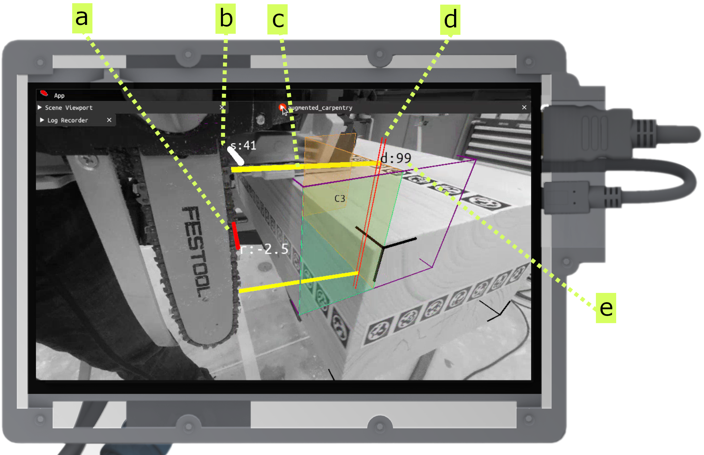
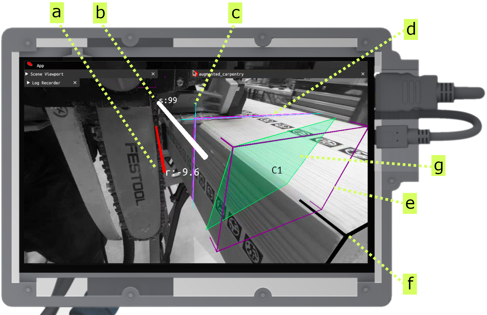

---
tags:
  - acim
  - UI
  - cut
  - chainsaw-blade
  - fab
---

Here's the step-by-step guide on how to use augmented-carpentry with a sword saw to realize basic joints: half-lap, and mainly butt joints. The feedback system is similar to the one for [chainsaws](cut-chainsaw.md).

<iframe src="https://player.vimeo.com/video/1069262039?h=ae496471bd&amp;badge=0&amp;autopause=0&amp;title=0&amp;player_id=0&amp;app_id=58479" frameborder="0" allow="autoplay; fullscreen; picture-in-picture; clipboard-write; encrypted-media" style="position:absolute;top:0;left:0;width:100%;height:100%;"></iframe>

 

# Step-by-step

<!-- Intro to UI and feedback components (pos, rot, depth) -->

<figure markdown>

</figure>

This is the overview of the feedback and widget system to assist you during the cut.

**a** - Feedback for blade rotation (in degrees). The goal is to diminish the line length corresponding to the angle error, to zero (green).

**b** - Feedback for balde position (in cm). The goal is to diminish the line length corresponding to the position error, to zero (green).

**c,e** - This is particular to the chainsaw feedback system. In order to obtain straight cuts both the base and tip of the chain needs to have equal heights. The yellow lines represent the distance to the bottom faces of bottom and tip blade. The idea is to have equidistant heights so that the two lines become green. The value `d:00` represents the shortest distances of both.

**d** - The blade projection on the bottom face.

<!-- Position: placing blade -->

<figure markdown>

    <iframe 
        src="https://player.vimeo.com/video/1069266325?h=646ddee2e2&amp;background=1&amp;autopause=0&amp;loop=1&amp;autoplay=1&amp;muted=1&amp;controls=0&amp;title=0&amp;byline=0&amp;portrait=0" 
        frameborder="0" 
        allow="autoplay; fullscreen; picture-in-picture" 
        allowfullscreen>
    </iframe>
    
    

</figure>

Adjust now the position until the indicator becomes green.

<!-- Rotation: rotate blade -->

<figure markdown>

    <iframe 
        src="https://player.vimeo.com/video/1069270960?h=fc01fb83b8&amp;background=1&amp;autopause=0&amp;loop=1&amp;autoplay=1&amp;muted=1&amp;controls=0&amp;title=0&amp;byline=0&amp;portrait=0" 
        frameborder="0" 
        allow="autoplay; fullscreen; picture-in-picture" 
        allowfullscreen>
    </iframe>
    
    

</figure>

Adjust now the rotation until the indicator becomes green.

<!-- Guide the cut towards the end -->

<figure markdown>

    <iframe 
        src="https://player.vimeo.com/video/1069273945?h=34d31f5906&amp;player_id=0&amp;app_id=58479&amp;byline=0&amp;portrait=0" 
        frameborder="0" 
        allow="autoplay; fullscreen; picture-in-picture" 
        allowfullscreen>
    </iframe>
    

</figure>

Now you can start cutting. During the cut make sure to keep the position and rotation values green, and push through the end of the cut. Stop before the value `d:00` is 0. This means that the blade reached the opposite joint face. In this case we stop a bit before.

<!-- Quick inspection to see the overlap -->

<figure markdown>

    <iframe 
        src="https://player.vimeo.com/video/1069275999?h=c0ad498177&amp;background=1&amp;autopause=0&amp;loop=1&amp;autoplay=1&amp;muted=1&amp;controls=0&amp;title=0&amp;byline=0&amp;portrait=0"
        frameborder="0" 
        allow="autoplay; fullscreen; picture-in-picture" 
        allowfullscreen>
    </iframe>
    

</figure>

Now you can start cutting. During the cut make sure to keep the position and rotation values green, and push through the end of the cut. If good, you can mark it as **Done** just like the [chainsaw](cut-chainsaw.md).

!!! cut-joint "Butt joints"
    

    <figure markdown>
    
    </figure>
    

    Just as the [chainsaw](cut-chainsaw.md), this tool can be used to cut butt joints. The feedback system is simplified here too: the blade's position and rotation are the only feedbacks. The goal is to have both values green.

    **a** - position feedback

    **b** - rotation feedback

    **c** - blade's axis projection on the timber volume

    **d** - blade's thickness projection on the timber volume

    **e** - active cutting face

    **f** - 3D model bounding box limits

    **g** - timber piece bounding box limits
    

    

    

    <figure markdown>
    

        <iframe 
            src="https://player.vimeo.com/video/1069280639?h=f7000242a0&amp;player_id=0&amp;app_id=58479&amp;byline=0&amp;portrait=0" 
            frameborder="0" 
            allow="autoplay; fullscreen; picture-in-picture" 
            allowfullscreen>
        </iframe>
        
    

    </figure>
    

    The system guides you to the end of the cut. Make sure to keep the position and rotation values green, and stop when the depth value touches 0 (the blade is now touching the opposite face).

     
    

    
