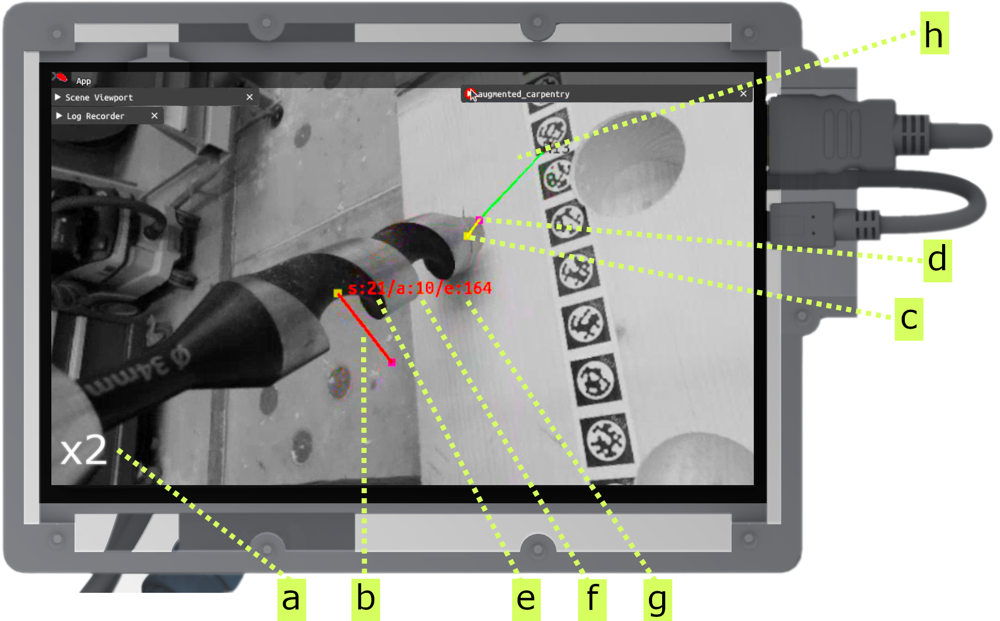
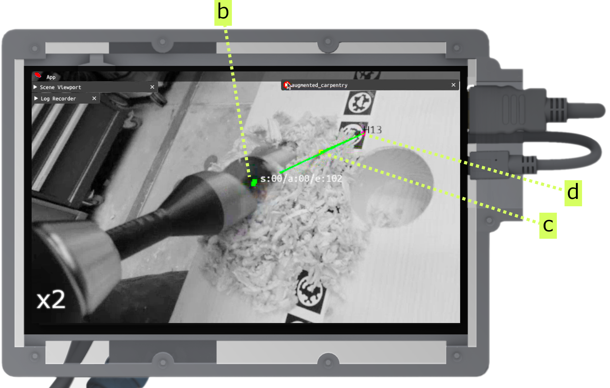

---
tags:
  - acim
  - UI
  - drill
  - fab
---

Here's the step-by-step guide on how to use augmented-carpentry with a drill. You can use any drill bits, provided that they are integrated in the [dataset](../hardware/woodworking-tools.md#available-toolheads).

<iframe src="https://player.vimeo.com/video/1069883490?h=74018c42d1&amp;badge=0&amp;autopause=0&amp;title=0&amp;player_id=0&amp;app_id=58479" frameborder="0" allow="autoplay; fullscreen; picture-in-picture; clipboard-write; encrypted-media" style="position:absolute;top:0;left:0;width:100%;height:100%;"></iframe>

 

# Step-by-step

<!-- Intro to UI and feedback components (pos, rot, depth) -->

<figure markdown>

</figure>

Illustration of the guidance provided by AC throughout the drilling procedure. The user needs to adjust first the position and rotation of the drill bit.

**a** the camera feed is zoomed twice

**b** orientation visual guide, where the correct starting positioning is a line connecting **c** and **d**

**c** tip of the toolhead

**d** the start of the drill hole

**e** rotation error in degrees. It corresponds to the angle between the drill bit and the hole.

**f** position error in mm. It corresponds to the distance between the tip of the drill bit and the start of the hole.

**g** depth error in mm. It corresponds to the distance between the tip of the drill bit and the bottom face of the hole.

<!-- Position + rotation: placing drill bit tip + orientation -->

<figure markdown>

    <iframe 
        src="https://player.vimeo.com/video/1069993155?h=385780972f&amp;background=1&amp;autopause=0&amp;loop=1&amp;autoplay=1&amp;muted=1&amp;controls=0&amp;title=0&amp;byline=0&amp;portrait=0" 
        frameborder="0" 
        allow="autoplay; fullscreen; picture-in-picture" 
        allowfullscreen>
    </iframe>
    
    

</figure>

Take the drill bit and adjust the position to match the first value to zero.

<!-- Rotation: rotate blade -->

<figure markdown>

    <iframe 
        src="https://player.vimeo.com/video/1070003251?h=00b23c15a4&amp;background=1&amp;autopause=0&amp;loop=1&amp;autoplay=1&amp;muted=1&amp;controls=0&amp;title=0&amp;byline=0&amp;portrait=0" 
        frameborder="0" 
        allow="autoplay; fullscreen; picture-in-picture" 
        allowfullscreen>
    </iframe>
    
    

</figure>

Adjust the rotation until the indicator becomes green and its value is as close as possible to zero. Once both position and rotation are correct, the drilling can start.

<!-- Intro to UI and feedback components (depth) -->

<figure markdown>

</figure>

Once the position and rotation are in place the drilling can start and the user needs to follow the depth feedback. The user needs to stop when the depth error is zero.

<!-- Depth + end sequence: adjust blade and go through the end -->

<figure markdown>

    <iframe 
        src="https://player.vimeo.com/video/1070006195?h=a26e322348&amp;background=1&amp;autopause=0&amp;loop=1&amp;autoplay=1&amp;muted=1&amp;controls=0&amp;title=0&amp;byline=0&amp;portrait=0" 
        frameborder="0" 
        allow="autoplay; fullscreen; picture-in-picture" 
        allowfullscreen>
    </iframe>
    
    

</figure>

Keep the values of rotation in check especially at the beginning of the drilling. The user needs to stop when the depth error is zero or close to it at the end of the hole. The yellow color indicates that the deviation is in the limit of tolerance and the drilling should stop.

<!-- Inspection (beam) -->

<figure markdown>

    <iframe 
        src="https://player.vimeo.com/video/1070009891?h=6f6a33d44c&amp;player_id=0&amp;app_id=58479&amp;byline=0&amp;portrait=0" 
        frameborder="0" 
        allow="autoplay; fullscreen; picture-in-picture" 
        allowfullscreen>
    </iframe>
    

</figure>

Mark as done and inspect the holes and see if you missed any.

