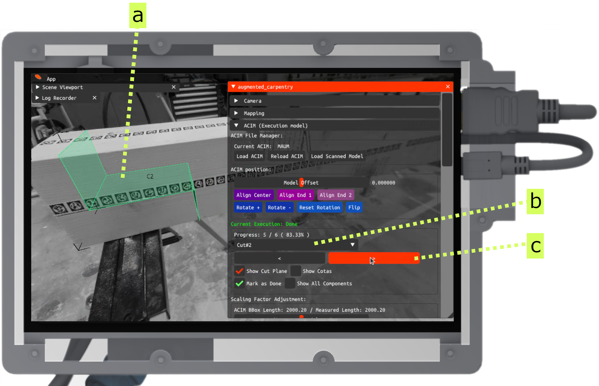

---
tags:
  - acim
  - UI
  - fab
---

Once you mapped the piece, you can load the [`.acim`](../developer-guide/acim.md) model to lock the execution model to the current timber element. This will allow you to visualize directly in 3D all the augmented cuts, drills and other information directly on the timber piece.

<iframe src="https://player.vimeo.com/video/1066589698?h=a4d4abba68&amp;badge=0&amp;autopause=0&amp;title=0&amp;player_id=0&amp;app_id=58479" frameborder="0" allow="autoplay; fullscreen; picture-in-picture; clipboard-write; encrypted-media" style="position:absolute;top:0;left:0;width:100%;height:100%;"></iframe>

 

# Step-by-step

<figure markdown>

</figure>

To operate machines with AC, you need to export a [`.acim`](../developer-guide/acim.md) file from your 3D modeling software. This file contains all the information required for the fabrication process, such as geometric information (e.g., joints and holes) and fabrication metadata (e.g., ID, fabrication status). For now we only support `.acim` files generated from Grasshopper.

 

Install `augmented-carpentry` via the **Package Manager** and export your structure via the component `acpy-acim-exporter`.

<!-- Load acim model (UI interface to select acim navigation) -->

<figure markdown>

    <iframe 
        src="https://player.vimeo.com/video/1065784971?h=5fdbc36df8&amp;badge=1&amp;autopause=0&amp;player_id=0&amp;app_id=58479&amp;title=0&amp;byline=0&amp;portrait=0"
        frameborder="0" 
        allow="autoplay; fullscreen; picture-in-picture" 
        allowfullscreen>
    </iframe>
    

</figure>

Once the mapping is processed and saved, you can load the [`.acim`](../developer-guide/acim.md) model to lock the execution model to the current piece.

<!-- acim loaded, general overview -->

<figure markdown>

    <iframe 
        src="https://player.vimeo.com/video/1066631456?h=863728af2c&amp;background=1&amp;autopause=0&amp;loop=1&amp;autoplay=1&amp;muted=1&amp;controls=0&amp;title=0&amp;byline=0&amp;portrait=0" 
        frameborder="0" 
        allow="autoplay; fullscreen; picture-in-picture" 
        allowfullscreen>
    </iframe>
    

</figure>

The execution model is now locked to the timber element and it can now be visualized in 3D.

<!-- acim loaded, moving piece -->

<figure markdown>

    <iframe 
        src="https://player.vimeo.com/video/1066595090?h=4f62581601&amp;background=1&amp;autopause=0&amp;loop=1&amp;autoplay=1&amp;muted=1&amp;controls=0&amp;title=0&amp;byline=0&amp;portrait=0" 
        frameborder="0" 
        allow="autoplay; fullscreen; picture-in-picture" 
        allowfullscreen>
    </iframe>
    

</figure>

Since the model is referenced to the timber element, moving the piece will not affect the tracking.

<!-- Overview of the pannel UI + cuts/drill widget on piece -->

<figure markdown>

</figure>

Let's start by looking at the different elements of the ACIM interface when the model is loaded.

**a** - a selected hole

**b** - a lap-joint in the unselected state

**c** - a hole in the unselected state

**d** - a selected lap-joint

**e** - a UI panel for execution model controls (`acim`)

**f** - dimension lines (cotas) that can be toggled on or off

**g** - basic I/O controls for ACIM

**h** - visual cues indicating the bounding box

**i** - a widget delineating the outer boundaries of the imported execution model

**o** - controls for adjusting the model's position and orientation

**p** - tools to navigate and designate holes or cuts as current

**q** - additional options specific to holes or cuts.

<!-- how to change and navigate cuts/drills -->

<figure markdown>

</figure>

To select the current cut or drill, use the list selector (**b**) or the arrows (**c**). The selected cut or drill will be highlighted in green (**a**). Based on the selected cut or drill, the corresponding UI will automatically appear for the right tool.

 

You are now ready to do some augmented woodworking.

!!! tip "Measurements and cotas"
    

    <figure markdown>
    

        <iframe 
            src="https://player.vimeo.com/video/1066639778?h=943e283a32&amp;badge=1&amp;autopause=0&amp;player_id=0&amp;app_id=58479&amp;title=0&amp;byline=0&amp;portrait=0" 
            frameborder="0" 
            allow="autoplay; fullscreen; picture-in-picture" 
            allowfullscreen>
        </iframe>
        
    

    </figure>
    

    Cotas and measurements can be toggled on or off. 
    They are useful to double check the dimensions of cuts if needed.For a single element select `Show Cotas`, for the whole model select `Show All Cotas`.
    

    

!!! tip "Multiple models"
    

    <figure markdown>
    

        <iframe 
            src="https://player.vimeo.com/video/1066661629?h=43f4383cc5&amp;player_id=0&amp;app_id=58479&amp;byline=0&amp;portrait=0" 
            frameborder="0" 
            allow="autoplay; fullscreen; picture-in-picture" 
            allowfullscreen>
        </iframe>
        
    

    </figure>
    

    You can also subdivide your fabrication in multiple `acim`s and load them differently. This can be useful if you have a complex piece with multiple parts like in this example of multiple perforations for a glulam beam.
    

    

     

!!! example "Troubleshooting out-of-scale model"
    

    <figure markdown>
    
    </figure>
    

    If you notice that the model is slightly bended or the boundaries are off, you can try to adjust the model's scaling. This can occur if your markers are not perfectly printed or if the camera calibration is not precise. Take a meter and measure the length between the purple limits of the beam (**a**). Insert the value with the slider in the `Scaling Factor Adjustements` section (**b**).
    

    

     