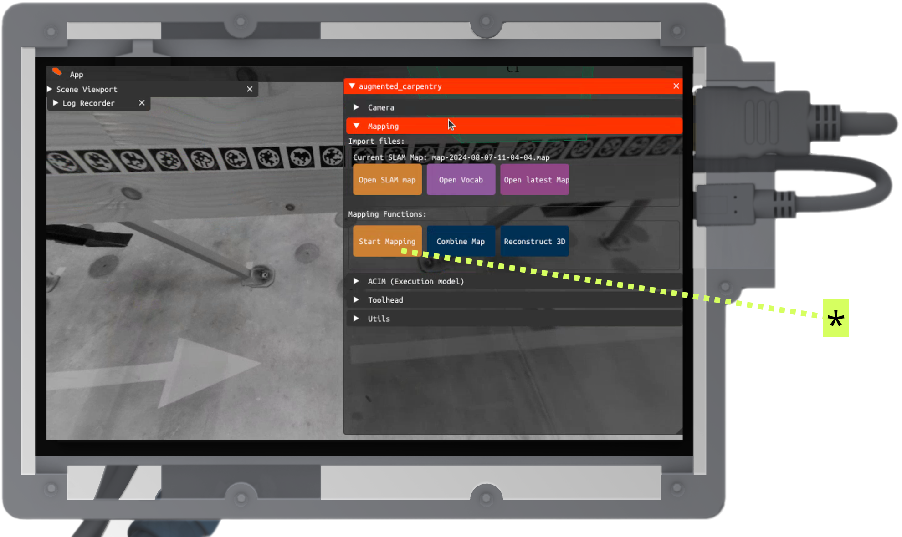
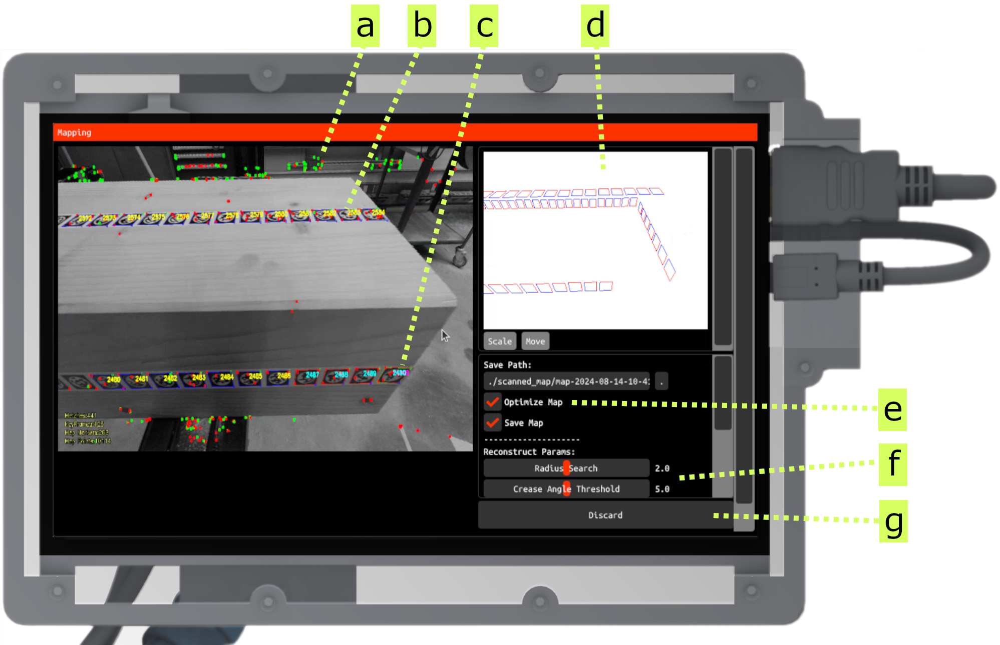
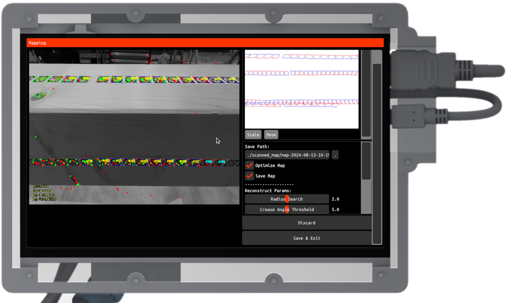
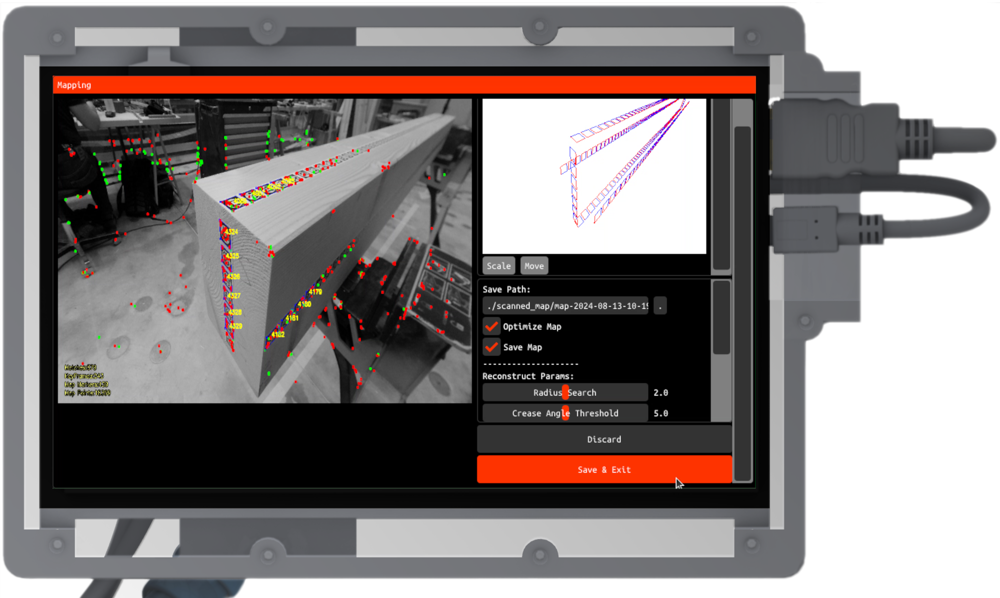

---
tags:
  - map
  - UI
  - fab
---

<!-- FIXME: Get rid of the title in the page? -->

Before you map the piece, stick the tags

<!-- TODO: Add tags to the timber piece -->

Go around the piece to map it

<!-- TODO: Add the video side by side of the mapping of one piece (maybe with drone??) -->

<!-- Start the mapping -->

<figure markdown>

</figure>

Click the button **Save & Exit** (**a**) to start the mapping process.

<!-- Mapping interface -->

<figure markdown>

</figure>

The mapping is now started.

**a** - landmark feature points used to facilitate camera localization

**b** - tags already acquired

**c** - newly detected tags pending acquisition

**d** - map-building overview

**e** - optimization parameters

**f** - reconstruction parameters for generating a mesh box from the registered tags

**g** - commands to save or discard the current mapping recording

<!-- TODO: transform this in a GIF and add the template to css -->
<!-- Mid mapping -->

<figure markdown>

</figure>

Go around the timber piece, turn it around, and capture as many tags as possible.

<!-- Mapping closing -->

<figure markdown>

</figure>

Click on the **Save & Exit** button to save the mapping and start the processing.

<!-- In case of reconstruction failure -->

<figure markdown>

    <iframe 
        src="https://player.vimeo.com/video/1065422379?h=3461c28610&amp;badge=1&amp;autopause=0&amp;player_id=0&amp;app_id=58479&amp;title=1&amp;byline=0&amp;portrait=0" 
        frameborder="0" 
        allow="autoplay; fullscreen; picture-in-picture" 
        allowfullscreen>
    </iframe>
    

</figure>

This is a **test** description.

<!-- Load acim model (UI interface to select acim navigation) -->

<!-- Visualize the piece with 3D model overlay -->

<!-- *Extra: Custom reconstruction -->