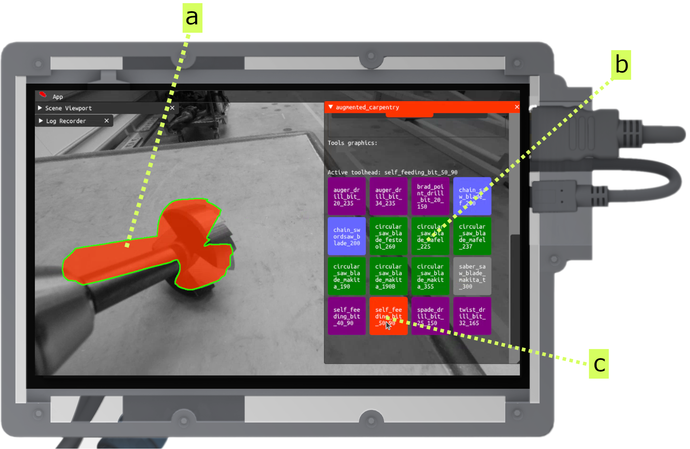
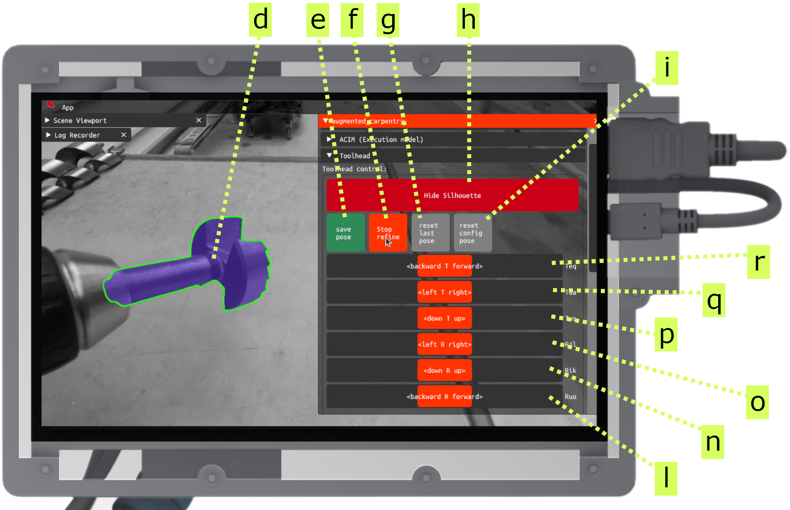

---
tags:
  - calibration
  - acit
  - UI
  - fab
---

Here we describe the calibration process of the tool heads. This is a crucial step to ensure the correct tracking of the inserted tool. This procedure needs to be done every time a tool is changed.

<iframe src="https://player.vimeo.com/video/1067338840?h=054bd5b1dc&amp;badge=0&amp;autopause=0&amp;title=0&amp;player_id=0&amp;app_id=58479" frameborder="0" allow="autoplay; fullscreen; picture-in-picture; clipboard-write; encrypted-media" style="position:absolute;top:0;left:0;width:100%;height:100%;"></iframe>

 

# Step-by-step

<!-- Select the tool UI explanation -->

<figure markdown>

</figure>

Open the **Toolhead** pane and select the tool you want to calibrate from the list of available tool heads:

**a** - rough projection of the selected tool head

**b** - library of selectable tool heads models

**c** - current selected tool head

 

If you want to add new tools follow the instructions in the section [contributing: add a new tool](../contributing/add-new-tool.md).

<!-- image: Input the pose manually UI explanation -->

<figure markdown>

</figure>

Once you have adjusted the camera to have the tool occupying the first half of the screen, you can input the initial pose of the tool head via the sliders (**q r p l o n**) first and then refine it (**f**):

**d** - machine-refined tool head position and orientation

**e** - confirm the pose

**f** - stop the refiner

**g** - reload the latest saved pose

**h** - hide the 3D model silhouette widget

**i** - reset the pose to the default value

**q r p** - sliders to input the 3D model's location

**l o n** - sliders to input the 3D model's rotation

<!-- video-auto: Input the pose manually -->

<figure markdown>

    <iframe 
        src="https://player.vimeo.com/video/1066887022?h=85c72e225f&amp;background=1&amp;autopause=0&amp;loop=1&amp;autoplay=1&amp;muted=1&amp;controls=0&amp;title=0&amp;byline=0&amp;portrait=0" 
        frameborder="0" 
        allow="autoplay; fullscreen; picture-in-picture" 
        allowfullscreen>
    </iframe>
    

</figure>

Use the sliders to estimate an initial position. It does not need to be precise, but it should be as close as possible to the real position and orientation of the tool head. Once you are satisfied, hit the button **Save pose**.

<!-- video-auto: Refine the pose -->

<figure markdown>

    <iframe 
        src="https://player.vimeo.com/video/1066892093?h=c8006bc436&amp;badge=0&amp;background=1&amp;autopause=0&amp;loop=1&amp;autoplay=1&amp;muted=1&amp;controls=0&amp;title=0&amp;byline=0&amp;portrait=0" 
        frameborder="0" 
        allow="autoplay; fullscreen; picture-in-picture" 
        allowfullscreen>
    </iframe>
    

</figure>

Now you can refine the pose by hitting the button **Start refine**. The model will turn blue and try to optimize your initial position. Move the tool around to help the system refine the pose.

<!-- video-auto: Input the pose manually -->

<figure markdown>

    <iframe 
        src="https://player.vimeo.com/video/1066896826?h=919865234d&amp;badge=0&amp;background=1&amp;autopause=0&amp;loop=1&amp;autoplay=1&amp;muted=1&amp;controls=0&amp;title=0&amp;byline=0&amp;portrait=0" 
        frameborder="0" 
        allow="autoplay; fullscreen; picture-in-picture" 
        allowfullscreen>
    </iframe>
    

</figure>

Once you are satisfied, hit the button **Stop refine** and **Save pose**, and **Hide silhouette**.

  

Your tool head is not calibrated.

<!-- TODO: multiple-tag: "drill - chainsaw - circular saw - etc": video-auto: Input the pose manually -->

!!! example "Troubleshooting blades with symbols"
    

    <figure markdown>
    

        <iframe 
            src="https://player.vimeo.com/video/1066942235?h=456358fca7&amp;badge=1&amp;autopause=0&amp;player_id=0&amp;app_id=58479&amp;title=1&amp;byline=0&amp;portrait=0" 
            frameborder="0" 
            allow="autoplay; fullscreen; picture-in-picture" 
            allowfullscreen>
        </iframe>
        
    

    </figure>
    

    Especially blades, like large circular saws, lack often geometric features to help the tool calibration. To help the system, you can add a logos or recognizable symbols to the blade (in this case the **EPFL** logo). The system will use these symbols to calibrate the tool head.
    

    

     