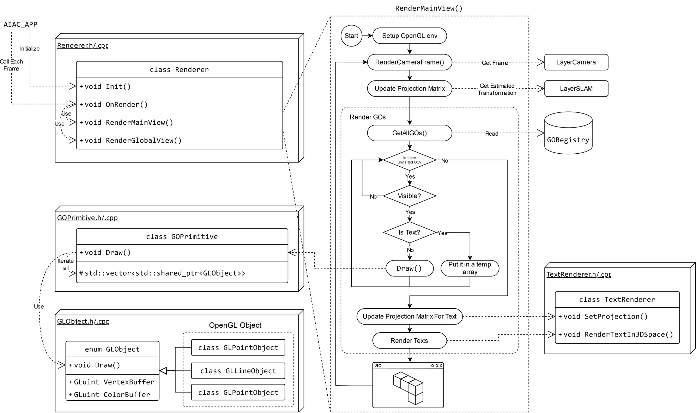

---
tags:
  - AREngine
  - render
---


# AR rendering

{align=center width=90% style='fill-color: #000000; filter: invert(100%);'}

## Rendering system
The rendering system renders the main AR view and multiple sub-viewports during different phases. The system consists of the following key components:

1. [`Renderer.h`](https://github.com/ibois-epfl/augmented-carpentry/blob/main/src/AIAC/Render/Renderer.h): Defines the core logic of the rendering pipeline and manages essential attributes.
2. [`Viewport.h`](https://github.com/ibois-epfl/augmented-carpentry/blob/main/src/AIAC/Render/Viewport.h): Handles the sub-frame buffer. The renderer calls [`Activate()`](https://github.com/ibois-epfl/augmented-carpentry/blob/e29ed367a88a3ec412fd1dc5ba136c6cc93f37aa/src/AIAC/Render/Viewport.cpp#L42) to switch the buffer for rendering.
3. [`GLObject.h`](https://github.com/ibois-epfl/augmented-carpentry/blob/main/src/AIAC/Render/GLObject.h): Helps GO manage OpenGL resources, allocating memory and buffering data for rendering. Each GO may contain one or multiple GLObjects stored in a list. By invoking Draw(), the content will be rendered to the currently active frame buffer.

!!! Tip
    `GOText` does not contains any `GLObject`, and its `Draw()` function does nothing. Instead, the rendering of `GOText` is handled separately through [`TextRenderer.h`](https://github.com/ibois-epfl/augmented-carpentry/blob/main/src/AIAC/Render/TextRenderer.h). Since we want to make the text always facing the screen instead of floating in the 3D space, a special projection method and shader program is required. As a result, the rendering of text is performed separately after all the other `GO`s are rendered.


## Rendering pipeline
The [`Renderer::OnRender()`](https://github.com/ibois-epfl/augmented-carpentry/blob/e29ed367a88a3ec412fd1dc5ba136c6cc93f37aa/src/AIAC/Render/Renderer.cpp#L115) function is executed after all layers are processed. It is the entry point of the rendering pipeline, which calls the corresponding functions to render different views depend on the current status.

``` cpp title="src/AIAC/Render/Renderer.cpp" linenums="1"
void Renderer::OnRender()
{
    // During mapping, an overlay panel is opened, so we only render things on it
    // and stop updating the main scene.
    // TODO: mapping has some problem when calib file is switched (with slam map)
    if(AIAC_APP.GetLayer<LayerSlam>()->IsMapping()) {
        // RenderGlobalView();
        RenderMappingView();
        return;
    }

    if(AIAC_APP.GetLayer<LayerCameraCalib>()->IsCalibrating()) {
        RenderCamCalibView();
        return;
    }

    // Default, render the main scene
    RenderMainView();
    RenderGlobalView();
}
```

### Sub-view Rendering
While in the mapping phase or performing camera calibration, the main view is blocked, so it will not be rendered. Instead, the corresponding sub-view will be rendered through [`RenderMappingView()`](https://github.com/ibois-epfl/augmented-carpentry/blob/e29ed367a88a3ec412fd1dc5ba136c6cc93f37aa/src/AIAC/Render/Renderer.cpp#L225) or [`RenderCamCalibView()`](https://github.com/ibois-epfl/augmented-carpentry/blob/e29ed367a88a3ec412fd1dc5ba136c6cc93f37aa/src/AIAC/Render/Renderer.cpp#L244).

### Main-view Rendering
During the fabrication phase, there're two viewports that needed to be rendered: The AR view and the global 3D view. The AR view combines captured images with virtual objects, such as CAD models and feedback graphics, to provide clear and intuitive instructions. The global 3D view serves as an interface for navigating through the entire scene, enabling users to easily inspect different components. The rendering of the two viewports are handled by two separate functions:

1. [`RenderMainView()`](https://github.com/ibois-epfl/augmented-carpentry/blob/e29ed367a88a3ec412fd1dc5ba136c6cc93f37aa/src/AIAC/Render/Renderer.cpp#L253) renders the main AR view by calculating the projection matrix using the estimated position from `LayerSLAM` and overlays all geometry from the `GORegistry` onto the captured image.
2. [`RenderGlobalView()`](https://github.com/ibois-epfl/augmented-carpentry/blob/e29ed367a88a3ec412fd1dc5ba136c6cc93f37aa/src/AIAC/Render/Renderer.cpp#L205) switches the frame buffer to the 3D viewport and renders the geometry with a projection based on the user's navigation.