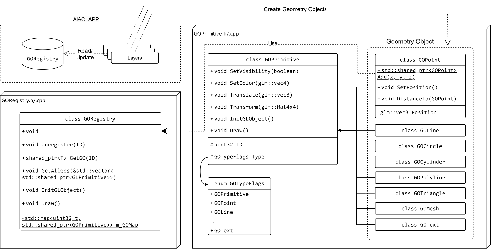

---
tags:
  - AREngine
  - go
---

# Geometry Framework

{align=center width=90% style='fill-color: #000000; filter: invert(100%);'}

The geometry framework provides a unified infrastructure for handling all 3D objects in the scene, including CAD models, scanned models, and fabrication instructions. This framework enables easy interaction between application layers and 3D objects while being tightly integrated with the rendering system, which implicitly manages OpenGL resources, simplifying the workload for application layers.

## Usage of Geometry Framework
The geometry framework is defined in [`GOPrimitive.h`](https://github.com/ibois-epfl/augmented-carpentry/blob/main/src/AIAC/GOSys/GOPrimitive.h). The geometry is organized into the following primitive shapes: point, line, circle, cylinder, polyline, triangle, mesh, and text. Each of them is a class (e.g., `GOPoint`, `GOLine`, `GOCircle`, etc.) that inherits the base class `GOPrimitive`, where "GO" stands for Geometry Object. The base class manages general attributes and provides interfaces such as visibility and transformation, while the subclasses handle their specific data and functions.

```cpp title="src/AIAC/GOSys/GOPrimitive.h" linenums="1"  hl_lines="15 18 22 23"
class GOPrimitive
{
public:
    inline uint32_t GetId() { return m_Id; }
    inline GOTypeFlags GetType() { return m_Type; }

    inline void SetVisibility(bool isVisible) { m_IsVisible = isVisible; }
    inline bool GetVisibility() { return m_IsVisible; }
    inline void SetColor(glm::vec4 color) { m_Color = color; InitGLObject();}
    inline glm::vec4 GetColor() const { return m_Color; }
    inline void SetName(std::string name) { m_Name = std::move(name); }
    inline std::string GetName() const { return m_Name; }

    virtual void Transform(const glm::mat4x4& transformMat) {};
    virtual void Translate(const glm::vec3& translation) {};

    inline void Draw() { for(auto glObject : m_GLObjects) glObject->Draw(); }

protected:
    uint32_t m_Id;
    std::string m_Name;
    bool m_IsVisible;
    glm::vec4 m_Color;
    GOTypeFlags m_Type;
    std::vector<std::shared_ptr<GLObject> > m_GLObjects;
};
```

!!!Tip
    The `m_Id` would be generated automatically when a new `GO` is initialized and is ensured to be unique in the system. `m_Type` can be used to easily determine the sub-class while the object is held as a `GOPrimitive` pointer. `Draw()` and `m_GLObjects` are used for rendering, which will be introduced in [AR-rendering](AR-rendering.md).

```cpp title="src/AIAC/GOSys/GOPrimitive.h" linenums="1"
class GOLine : public GOPrimitive
{
private:
    GOLine();
    GOLine(GOPoint p1, GOPoint p2, float weight = GOWeight::Default);

public:
    static std::shared_ptr<GOLine> Add();
    /**
        * @brief Add GOLine to the scene.
        *
        * @param p1 First point of the line.
        * @param p2 Second point of the line.
        * @param weight Weight of the line.
        * @return uint32_t Id of the line.
        */
    static std::shared_ptr<GOLine> Add(GOPoint p1, GOPoint p2, float weight = GOWeight::Default);

    /**
        * @brief Compute the angle between the current line object and another one with a sign
        *
        * @param ptrGO2 the second line
        * @return float the angle in degrees
        */
    float ComputeSignedAngle(std::shared_ptr<GOLine> ptrGO2);

private:
    GOPoint m_PStart;
    GOPoint m_PEnd;

friend class GOPoint;
};
```

!!!Tip
    To initialize a `GO` object, instead of calling the constructor, one must use the static function `Add()` of the corresponding class to create an object. This is due to the design of the `GORegistry`, which manages all GOs, ensuring them accessible across the system.

### Creating a GO
The `GO` needed to be initialized using `Add()` function, which returns a `std::shared_ptr<GO>`. For example, to create a point at the origin:
```c++
std::shared_ptr<GOPoint> origin = GOPoint::Add(0, 0, 0);
```

The only exception that you can create without using the `Add()` function is `GOPoint`, as they are used as parameters in other `GO`s. For example, to create a `GOLine`:
```c++
GOPoint p1 = GOPoint(0, 0, 0);
GOPoint p2 = GOPoint(1, 1, 1);
std::shared_ptr<GOLine> line = GOLine::Add(p1, p2);
```

## GO Registry
The system maintains a global registry, [`GORegistry`](https://github.com/ibois-epfl/augmented-carpentry/blob/main/src/AIAC/GOSys/GORegistry.h), to keep track of all GOs. When the `Add()` function of the `GO` is called, it acquires a unique UUID(`m_Id`) and registers itself in the global hash table. Since this table is accessible throughout the entire system, it maximize the accessbility of GOs.

### Interact with GO Registry
To access the global registry, one can use the macro `AIAC_GOREG` to get the instance. It provides two APIs to retrive GO(s): either getting one by its UUID or all objects registered in the system.

To retrieve a `GO` by its id:
```c++
std::shared_ptr<GOPoint> obj = AIAC_GOREG->GetGO<GOPoint>(id);
```

To get all `GO`s in the registry:
```c++
std::vector<std::shared_ptr<GOPrimitive>> gos;
AIAC_GOREG->GetAllGOs(gos);
```
