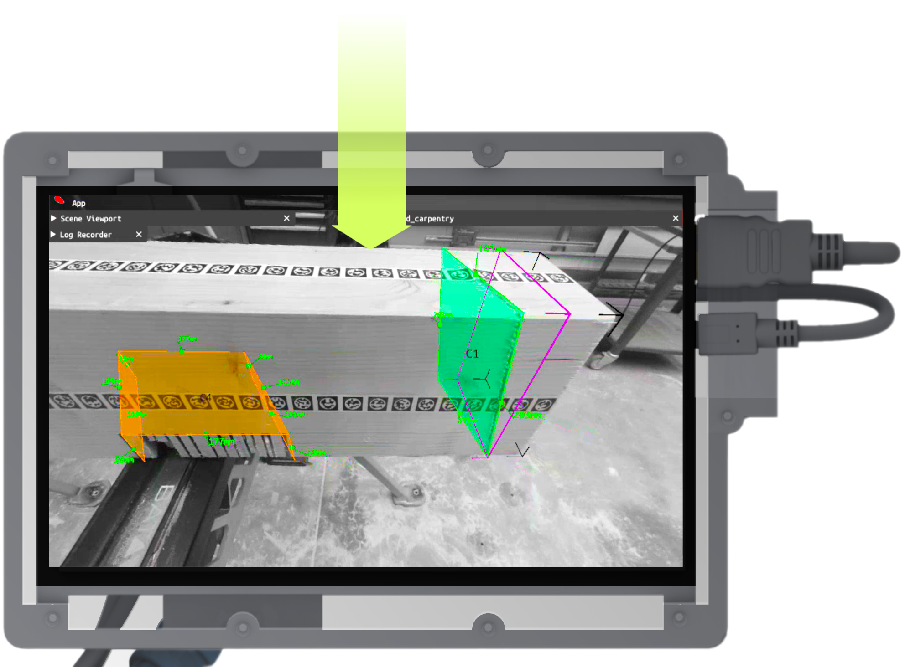

---
tags:
  - acim
  - I/O
  - backend
  - Rhino
---

# Execution model

The `.acim` file represents the execution model in the **AC** system. An execution model is needed to provide the necessary information for the fabrication process. It can be produced with any 3D modeling software.

`.acim` is the AC's XML-based format, similar to standard exchange formats such as *BTLx*, and contains both geometric information (e.g., joints and holes) and fabrication metadata (e.g., ID, fabrication status).

During our prototyping phase, we use [*Rhinoceros 3D* with a custom script](https://github.com/ibois-epfl/augmented-carpentry/blob/main/py/components/acimexporter/code.py) that automatically detects joints and holes in the 3D model. With a single click, each element (e.g., beam, panel) can be exported to an `.acim` file without manually creating additional 2D documentation.

{width=700} 

{width=700}


## `.acim` file structure

The `.acim` file is currently storing all the information required for the fabrication process. The file parse and store the geometries in 3 components:

* `<timber>`: as the main container object
* `<hole>`: represents all perforations in the model
* `<cut>`: represents all the cuts in the model

### `<timber>`

The `<timber>` tag represents the main component of the model. It contains the ID, the fabrication status, the current cut, and the bounding box of the component.

The `<bbox>` tag contains the coordinates of the corners of the object oriented bounding box in which the timber element is exported. The corners are represented by their coordinates in the 3D space. This is a fundamental element that we already include in the `.acim` file that will be later used by AC for registering the model to the map (see [`void LayerModel::AlignModels()`](https://github.com/ibois-epfl/augmented-carpentry/blob/ecc39246c4996833e271c96de244561f85d6dc81/src/AIAC/LayerModel.cpp#L121-L179))

[:octicons-file-code-16: `example.acim`](../../assets/example_files/C003.acim)
```xml
<timber id="C003">
  <executed>NotDone</executed>
  <current>Cut#1</current>
  <bbox>
    <corner id="0">-0.0010000377932458662 9.996989965467265e-05 9.989726472193752e-05</corner>
    <corner id="1">2.296127411397951 9.996989965467265e-05 9.989726472193752e-05</corner>
    <corner id="2">2.296127411397951 0.13990003039836885 9.989726472193752e-05</corner>
    <corner id="3">-0.0010000377932458662 0.13990003039836885 9.989726472193752e-05</corner>
    <corner id="4">-0.0010000377932458662 9.996989965467265e-05 0.13990000059604646</corner>
    <corner id="5">2.296127411397951 9.996989965467265e-05 0.13990000059604646</corner>
    <corner id="6">2.296127411397951 0.13990003039836885 0.13990000059604646</corner>
    <corner id="7">-0.0010000377932458662 0.13990003039836885 0.13990000059604646</corner>
  </bbox>
```


### `<hole>`

Holes are represented by their vector and radius and have the `<state>` tag to indicate their fabrication status. The `<neighbors>` tag indicates the number of neighboring holes for composite holes (e.g. a hole and a washer). The two following highlighted holes are neighbors, whereas the third hole is not.^(`<neighbors>-1</neighbors>`)

[:octicons-file-code-16: `example.acim`](../../assets/example_files/C003.acim)
```xml hl_lines="1 14"
<hole id="Hole#1">
  <state>Done</state>
  <neighbors>2</neighbors>
  <start>
    <exposed>False</exposed>
    <coordinates>1.60538 0.07 8.34301e-16</coordinates>
  </start>
  <end>
    <exposed>False</exposed>
    <coordinates>1.60538 0.07 0.12</coordinates>
  </end>
  <radius>0.01</radius>
</hole>
<hole id="Hole#2">
  <state>Done</state>
  <neighbors>1</neighbors>
  <start>
    <exposed>False</exposed>
    <coordinates>1.605380574691806 0.06999999999999534 0.14000000000000057</coordinates>
  </start>
  <end>
    <exposed>False</exposed>
    <coordinates>1.605380574691806 0.06999999999999536 0.1200000000000006</coordinates>
  </end>
  <radius>0.025</radius>
</hole>
<hole id="Hole#3">
  <state>Done</state>
  <neighbors>-1</neighbors>
  <start>
    <exposed>False</exposed>
    <coordinates>0.544337 0.0700887 8.99337e-16</coordinates>
  </start>
  <end>
    <exposed>False</exposed>
    <coordinates>0.544337 0.0700887 0.07</coordinates>
  </end>
  <radius>0.017</radius>
</hole>
```

### `<cut>`

Cuts are represented by their center, *faces*, and *edges*. The `<state>` tag indicates the fabrication status as well. For *faces*, the `<exposed>` tag indicates whether the face is exposed or not. The `<edges>` tag contains the IDs of the edges that form the face. The `<corners>` tag contains the coordinates of the corners that form the face. All the elements, as for the holes, are composed by simple primitive points.

[:octicons-file-code-16: `example.acim`](../../assets/example_files/C003.acim)
```xml linenums="1"
<cut id="Cut#1">
  <state>NotDone</state>
  <center>0.06949998110337721 0.07000000000000012 0.07000000000000067</center>
  <faces>
    <face id="0">
      <state>NotDone</state>
      <exposed>True</exposed>
      <edges>0 2 4 6 10 11</edges>
      <corners>
        <corner id="0">0.14000000000000012 0.0 0.07000000000000117</corner>
        <corner id="1">0.14000000000000012 9.977733010676742e-16 0.13990000059604646</corner>
        <corner id="2">-0.0010000377932458662 9.996989965467265e-05 0.13990000059604646</corner>
        <corner id="3">-0.0010000377932458662 9.996989965467265e-05 9.989726472193752e-05</corner>
        <corner id="4">0.0 9.992007221626409e-16 9.989726472193751e-05</corner>
        <corner id="5">0.0 9.992007221626409e-16 0.07000000000000117</corner>
      </corners>
    </face>
    ..
  </faces>
  <edges>
    <edge id="0">
      <start>-0.0010000377932458662 9.996989965467265e-05 9.989726472193752e-05</start>
      <end>0.0 9.992007221626409e-16 9.989726472193751e-05</end>
    </edge>
    ..
  </edges>
</cut>
```

## `.acim` parsing

In AC the responsible layer is the [`LayerModel`](https://github.com/ibois-epfl/augmented-carpentry/blob/main/src/AIAC/LayerModel.h) that is in charge of parsing the `.acim` file.

The`m_ACInfoModel` (Augmented Carpentry Informed Model) object is responsible for parsing the `.acim` file and add all the corresponding *GO*s objects in the scene by using the `TimberInfo` class. The `m_ACInfoModel` object is a singleton that is accessible from all the layers of the system.