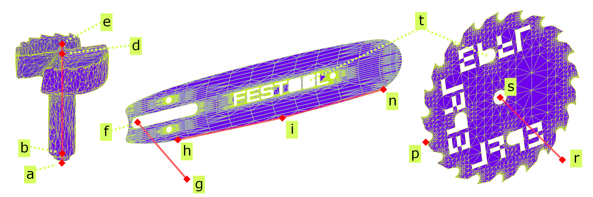

---
tags:
  - acit
  - I/O
  - backend
---

# Toolheads

[3D models of each toolhead](../hardware/woodworking-tools.md#available-toolheads) is needed to feed to our 6DoF pose detector. But in the AR instructions we are not using the mesh model of the toolhead itself but rather only points of interest (POIs) on this model. These POIs are used as a convinient data to generate fabrication instructions easly, and they define base points, tips, axis, thickness, etc. Depending on the toolhead type, the file contains different point coordinates important to simplify the digital representation of the toolhead.

In the current version of AC, these POIs are manually defined in the codebase via the addition of a xml-base file `.acit` (Augmented Carpentry Instruction Toolhead).

{width=90%}

<div style="text-align: center; color: darkgray; font-size: 0.9em; font-style: italic;">
POIs of drillbits, chainsaw bars, and circular saw blades integrated in the AC system: drillbit (a) base, (b) chuck, (d) eating, and (e) tool tips; chainsaw bar (f) base, (g) normal, sawchain's (h) start, mid and end points; circular saw blade (i) center, (r) normal and (p) radial point.
</div>


## `.acit` file structure

Each type of toolhead has its own specific POIs. For now the following toolheads are supported:

- `drillbit`: the bit is represented by the base, chuck, eating, and tool tips
- `circular saw blade`: the blade is represented by the center 
- `chainsaw bar`: we track the bottom perimeter of the bar and add the thickness of the sawchain

Let's have a look at the `drillbit` toolhead as an exampel that has `tooltip`, `eattip`, `chucktip`, and `radius` POIs. The `.acit` file is used to store these POIs in a structured way.
Example of a drillbit toolhead `.acit` file:
```xml
<acit version="0.1.0">
  <toolhead name="auger_drill_bit_20_235" type="drillbit">
    <toolbase> 0 0 0 </toolbase>
    <tooltip> 0 0 0.235 </tooltip>
    <eattip> 0 0 0.228 </eattip>
    <chucktip> 0 0 0.075 </chucktip>
    <radius> 0.02 </radius>
  </toolhead>
</acit>
```

## `.acit` parsing

When imported in AC, `.acit` files are parsed into corresponding tool types data classes [here](https://github.com/ibois-epfl/augmented-carpentry/blob/main/src/AIAC/ACInfoToolhead.h) in the [`LayerToolhead.h`](../../src/AIAC/LayerToolhead.h). 

DrillBit data class:
```cpp
std::string NameACIT;
float RadiusACIT;
glm::vec3 ToolbaseACIT;
glm::vec3 TooltipACIT;
glm::vec3 EattipACIT;
glm::vec3 ChucktipACIT;
```

All the tools are held in the `ACInfoToolheadManager`. The current toolhead can be retrieved from everywhere in the system by calling the `AIAC_APP.GetLayer<LayerToolhead>()->ACInfoToolheadManager->GetActiveToolhead()` function.

!!! note
    The `.acit` is also used together with another file `.initpose` indicating the initial pose of all the parsed POIs:
    ```
      [ -7.73640037e-01, 4.15423065e-01, -4.78431463e-01, -5.23223341e-01,
          -8.44716668e-01, 1.12603128e-01, -3.57363552e-01, 3.37440640e-01,
          8.70876431e-01, 0., 0., 2.20000029e-01 ]
    ```