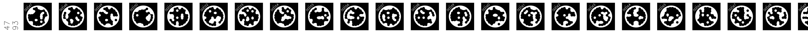

# Hardware

AC needs a very simple setup to work. You need a computing unit, a touch screen, a camera and a set of stickers, and of course some wood working tools.

{width="900"}

## Computing unit, interface and sensors
AC works on *x64 machines* running on *Ubuntu 22.04 LTS* and a simple *monocular camera*. For a quick start, you can use a laptop and your webcam. If you want to build on a touch screen, you can use the WaveShare WS170120 and follow the instructions below:

To config the touch screen on the pc follow [these steps first](https://www.waveshare.com/wiki/7inch_HDMI_LCD). Be sure to switch the display on, plug the mini-USB and finally plug the HDMI cable.

Set the display properties in the `config.ini` properties (to find them run the commands `xinput`  for the name and `xrandr` for the connection type).

The following specs works on the X11 display server. If you are using wayland and wanting to switch to X11 follow [this link](https://helpdesk.psionline.com/hc/en-gb/articles/13470827149332-How-to-perform-the-switch-from-the-Wayland-display-server-to-Xorg-X11-on-Linux-Ubuntu-22-04-LTS). You can use any other touch screen, just make sure to set the correct specs in the `config.ini` file:

```c++ title="config.ini"
[MonitorSpecs]
monitor_name = WaveShare WS170120
monitor_link_t = HDMI
monitor_resolution = 1280 x 720
```

!!! warning

    Wayland display and touchscreen are not compatible yet as the touchscreen register for the main display and not the small display.

    ```c++ title="config.ini"
    [MonitorSpecs]
    LinkMode = XWAYLAND1
    Name = Virtual core pointer
    Resolution = 1280 x 720
    ```

For a quick test or development you can use a laptop and the webcam. Just adjust later the CMake config option.

=== "Laptop"

    ``` c++
    cmake -S . -B build -DDEPLOY_ON_TOUCH=OFF
    ```

=== "Touch screen"

    ``` c++
    cmake -S . -B build -DDEPLOY_ON_TOUCH=ON
    ```


## Wood working tools
AC is designed to be *machine independent*, it is only dependent on the toolheads (e.g.: drill bits, circular saw blades and chainsaw boards). You can find a list of the available toolheads [here](https://zenodo.org/records/12578820). If you want to add your own, open a Pull Request to the repo [TTool](https://github.com/ibois-epfl/TTool) and follow the [Wiki](https://github.com/ibois-epfl/TTool/wiki).


## Stickers



The last thing you need is a set of *STags*. These are the markers that help the camera understand its position and orientation to the timber beam. You can find them as 450 stripes for a total of 21149 tags are available in batches of 50 stripes with an A0 format, ready to print (better as stickers) and can [be downloaded here](https://zenodo.org/record/7738721/files/stag_stickers_ready.zip?download=1). They are made to be print as stickers, but if you want to generate your own you can find a [script here](https://github.com/ibois-epfl/TSlam/tree/main/stag_util).