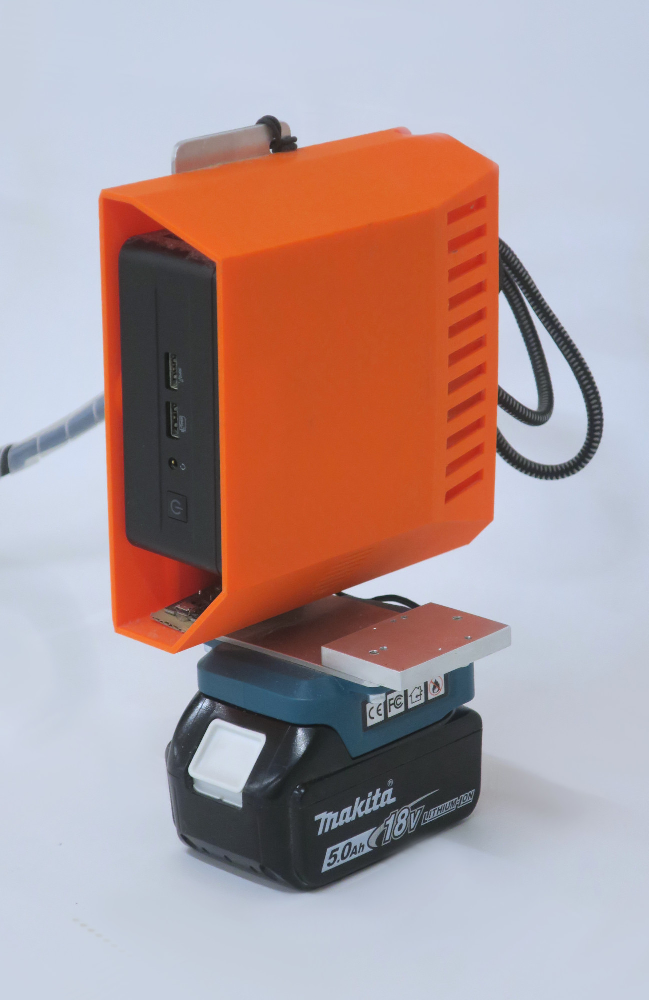
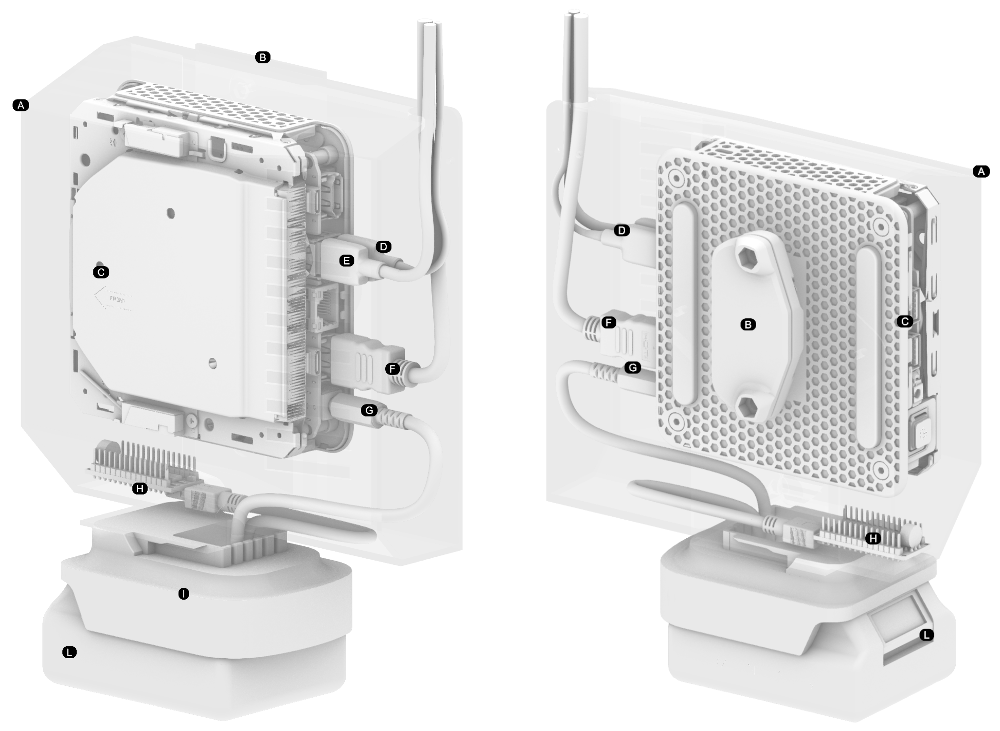
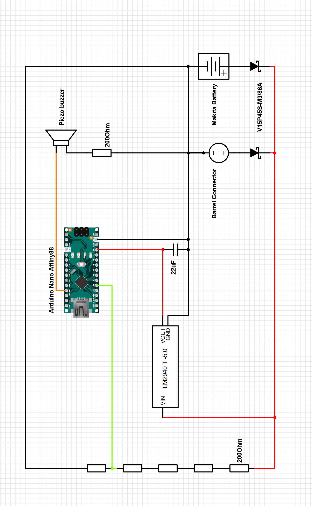

# Computing unit

AC's prototype is built for x64 machines running on Ubuntu 22.04 LTS. The system does not exploit GPU acceleration and can run on a laptop, a portable computing unit or a desktop.

=== ":fontawesome-solid-briefcase:&nbsp;&nbsp; Wearable"

    /// html | div[style='float: left; width: 40%;']
    
    {width="380" class="rounded-corners"}
    
    ///

    /// html | div[style='float: right;width: 60%;']

    In our current prototype we wanted to develop a computing unit that could be easily transported and used in construction sites and shops. For this reason we decided to use a x64 machine of type [NUC](https://en.wikipedia.org/wiki/Next_Unit_of_Computing) with these specifics:

    !!! quote ""
        ```bash
        OS: Ubuntu 22.04.3 LTS x86_64 
        Host: NUC13ANHi7 M89903-203 
        Kernel: 6.8.0-40-generic 
        Uptime: 8 mins 
        Packages: 2299 (dpkg), 17 (snap) 
        Shell: bash 5.1.16 
        Resolution: 1024x600 
        DE: GNOME 42.9 
        WM: Mutter 
        WM Theme: Adwaita 
        Theme: Yaru [GTK2/3] 
        Icons: Yaru [GTK2/3] 
        Terminal: gnome-terminal 
        CPU: 13th Gen Intel i7-1360P (16) @ 5.000GHz 
        GPU: Intel Device a7a0 
        Memory: 1622MiB / 31645MiB
        ```
    
    ///

    /// html | div[style='clear: both;']
    ///

    We decided such machine for our wearable AR system for the following reasons:

    `x64 target machine`
    :   More importantly, it has the same architecture as a laptop or a desktop, which streamlines the development process (e.g. no `.apk` files to generate and deploy on the device). Additionally, being on UNIX x64 machines, we could leverage all the top notch libraries and dependecies available from robotics and computer vision communities.

    `Small factor`
    :   It is a small form factor computer that can be easily transported.

    ` Low power consumption`
    :   It is energy efficient and can be powered by a 18v (5.0Ah) battery for power tools.

    `Ordinary Sensor Interface`
    :   It has a USB interface which is common and can be used to connect the camera as well as any other device (e.g. touch screen).

    ## Components list

    !!! print-parts "Parts"

        {width="600"}

        The battery is a 18v (5.0Ah) battery that can be used for power tools. The battery is connected to the NUC via a 5v regulator (LM785) to ensure a stable power supply. The battery is also connected to a buzzer that will beep when the battery voltage is below a certain threshold (circa 15%). This will inform the user to change the battery.
        Here's the list of the parts you will need to obtain or realize:

        - [x] &nbsp;&nbsp; (**C**) NUC
        - [x] &nbsp;&nbsp; (**B**) Protective case for the NUC:
            - x1 [:octicons-file-code-16: `assets/hardware_parts/nuc/nucpoite2.stl`](https://github.com/ibois-epfl/augmented-carpentry/blob/main/assets/hardware_parts/nuc/nucpoite2.stl)
        - [x] &nbsp;&nbsp; (**L**) 1x Power tool battery 18v (5.0Ah)
        - [x] &nbsp;&nbsp; (**I**) Battery adapter
        - [x] &nbsp;&nbsp; (**B**) 1x Metal support to connect NUC case, battery adapter, and belt clip
        - [x] &nbsp;&nbsp; (**G**) 1x 5v regulator (LM785)
        - [x] &nbsp;&nbsp; (**E**) 1x USB 2.0 input and alimentation for touch screen
        - [x] &nbsp;&nbsp; (**D**) 1x USB 3.0 camera connection
        - [x] &nbsp;&nbsp; (**F**) 1x HDMI for touch screen
        - [x] &nbsp;&nbsp; (**H**) 1x Battery monitor

        ???+ example "Battery monitor blueprint"

            As a bonus, here's the diagram and code snippet shows how to monitor the battery voltage connected to a NUC using a buzzer. The buzzer will inform when needs to be changed.

            To realize this schematic, you will need the following components:

            - [x] &nbsp;&nbsp; 1x Arduino Nano
            - [x] &nbsp;&nbsp; 1x DIY cable sleeve
            - [x] &nbsp;&nbsp; 1x piezo buzzer
            - [x] &nbsp;&nbsp; 6x resistors 200ohm

            {align=left width="500" class="rounded-corners"}

            ``` c++ title="assets/arduino_scripts/battmonitor.ino"
            --8<-- "assets/arduino_scripts/battmonitor.ino.ino"
            ```

        [^1]: printed on a Pruse MK3d+ on PLA.

=== ":fontawesome-solid-laptop-code:&nbsp;&nbsp; Laptop"

    If you are using a laptop or a desktop, you just need *at least*[^2] Ubuntu 22.04.3 LTS x86_64 installed on your machine and you are good to go.

[^2]: AC has not been tested on more recent LTS versions other than 22.04.3.