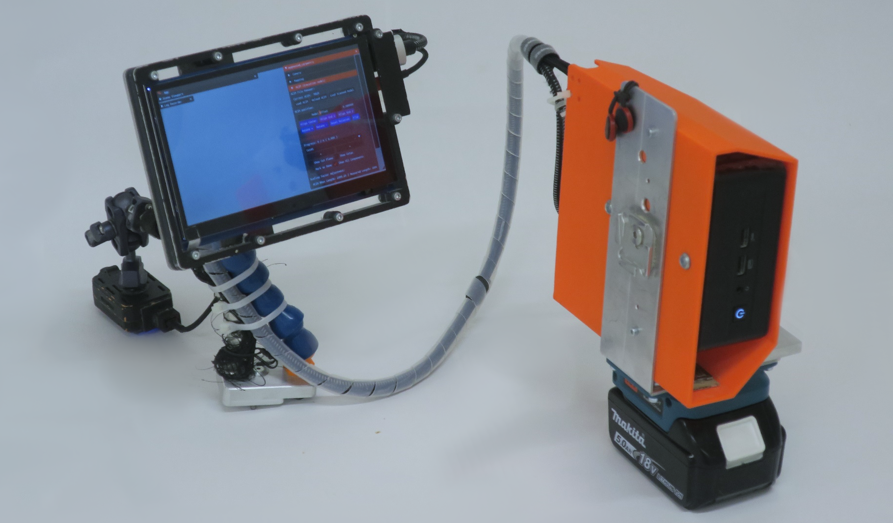

# Hardware overview

AC needs just a simple x64 machine running on Ubuntu 22.04 LTS an interface and a monocular camera. It does not exploit GPU acceleration and can run on a laptop, a portable computing unit (e.g. [NUC](https://en.wikipedia.org/wiki/Next_Unit_of_Computing)) or a desktop.

{width="900"}