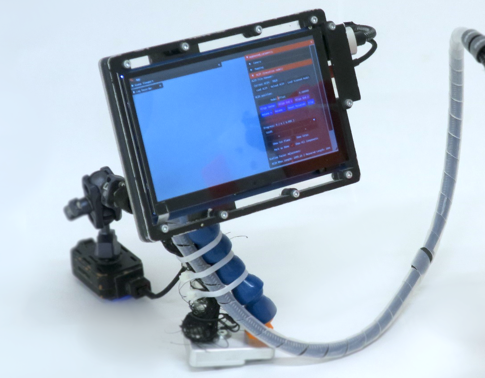

# Interface

AC is designed as a console app with a [GUI](https://en.wikipedia.org/wiki/Graphical_user_interface). This means that it can work with a touch screen (via HDMI) or a laptop. The interface is designed to be simple and intuitive. The main goal is to provide a quick and familiar way to interact with the system where every touch operations is in reality a click operation. This way we can develop our AR software without bodering for dedicated development on more complex [HMDs](https://en.wikipedia.org/wiki/Head-mounted_display) or advanced AR interfaces that would offer more ergonomic value to the cost of an increase complexity during the deployement and a steeper learning curve for the users.


=== ":fontawesome-solid-briefcase:&nbsp;&nbsp; Wearable"

    /// html | div[style='float: left; width: 58%;']
    
    {width="700" class="rounded-corners"}
    
    ///

    /// html | div[style='float: right;width: 40%;']
    
    You can use the [WaveShare WS170120](https://www.waveshare.com/wiki/7inch_HDMI_LCD_(B)) as in the current AC prototype and follow the instructions below. To config the touch screen on the pc follow [these steps first](https://www.waveshare.com/wiki/7inch_HDMI_LCD). Be sure to switch the display on, plug the mini-USB and finally plug the HDMI cable.
    
    ///

    /// html | div[style='clear: both;']
    ///

    ## Components list

    !!! print-parts "Parts"

        Here's the list of the parts you will need to obtain or realize:

        - [x] &nbsp;&nbsp; WaveShare WS170120
        - [ ] &nbsp;&nbsp; Support and tool-side attach for the screen
            * [x] &nbsp;&nbsp; locline (1/2" - passage 12 mm)
            * [x] &nbsp;&nbsp; 3D printed parts
                - x1 [:octicons-file-code-16: `assets/hardware_parts/touchscreen/nuts_ecran.stl`](https://github.com/ibois-epfl/augmented-carpentry/blob/main/assets/hardware_parts/touchscreen/nuts_ecran.stl)
                - x1 [:octicons-file-code-16: `assets/hardware_parts/touchscreen/reinforce_attachusb.stl`](https://github.com/ibois-epfl/augmented-carpentry/blob/main/assets/hardware_parts/touchscreen/reinforce_attachusb.stl)
                - x1 [:octicons-file-code-16: `assets/hardware_parts/touchscreen/screen_board_3.stl`](https://github.com/ibois-epfl/augmented-carpentry/blob/main/assets/hardware_parts/touchscreen/screen_board_3.stl)
                - x1 [:octicons-file-code-16: `assets/hardware_parts/touchscreen/locline_attach.stl`](https://github.com/ibois-epfl/augmented-carpentry/blob/main/assets/hardware_parts/touchscreen/locline_attach.stl)
            * [x] &nbsp;&nbsp; Screen rigs to CNC cut
                - x1 [:octicons-file-code-16: `assets/hardware_parts/touchscreen/back_screen.pdf`](https://github.com/ibois-epfl/augmented-carpentry/blob/main/assets/hardware_parts/touchscreen/back_screen.pdf)
                - x1 [:octicons-file-code-16: `assets/hardware_parts/touchscreen/back_screen.dxf`](https://github.com/ibois-epfl/augmented-carpentry/blob/main/assets/hardware_parts/touchscreen/back_screen.dxf)
                - x1 [:octicons-file-code-16: `assets/hardware_parts/touchscreen/screen_board_1.dxf`](https://github.com/ibois-epfl/augmented-carpentry/blob/main/assets/hardware_parts/touchscreen/screen_board_1.dxf)
                - x1 [:octicons-file-code-16: `assets/hardware_parts/touchscreen/screen_board_2.dxf`](https://github.com/ibois-epfl/augmented-carpentry/blob/main/assets/hardware_parts/touchscreen/screen_board_2.dxf)
            * [x] &nbsp;&nbsp; Magnet attachement to the tool
                - x1 [:octicons-file-code-16: `assets/hardware_parts/touchscreen/magnet_screenside.pdf`](https://github.com/ibois-epfl/augmented-carpentry/blob/main/assets/hardware_parts/touchscreen/magnet_screenside.pdf)
                - x1 [:octicons-file-code-16: `assets/hardware_parts/touchscreen/nucpoite2.stl`](https://github.com/ibois-epfl/augmented-carpentry/blob/main/assets/hardware_parts/touchscreen/nucpoite2.stl)
            * [x] x10 M3x10 threaded inserts
            * [x] x10 M3x10 nuts
        - [x] &nbsp;&nbsp; USB 2.0 cable (length: 1.5m)
        - [x] &nbsp;&nbsp; HDMI (length: cable 1.5m)
        - [x] &nbsp;&nbsp; Cable protections and fixations
        - [x] &nbsp;&nbsp; [:octicons-file-code-16: `assets/hardware_parts/nucpoite2.stl`](https://github.com/ibois-epfl/augmented-carpentry/blob/main/assets/hardware_parts/nucpoite2.stl)


        Set the display properties in the `config.ini` properties (to find them run the commands `xinput`  for the name and `xrandr` for the connection type).

        The following specs works on the X11 display server also, but you can use any other touch screen, just make sure to set the correct specs in the `config.ini` file:

        ```c++ title="config.ini"
        [MonitorSpecs]
        monitor_name = WaveShare WS170120
        monitor_link_t = HDMI
        monitor_resolution = 1280 x 720
        ```

        ??? warning "XWayland"

            Wayland display and touchscreen are not compatible yet as the touchscreen register for the main display and not the small display.

            ```c++ title="config.ini"
            [MonitorSpecs]
            LinkMode = XWAYLAND1
            Name = Virtual core pointer
            Resolution = 1280 x 720
            ```

=== ":fontawesome-solid-laptop-code:&nbsp;&nbsp; Laptop"

    In case you use a laptop or a desktop, you can use the touchpad or a mouse to interact with the system as you would do for any other desktop application.