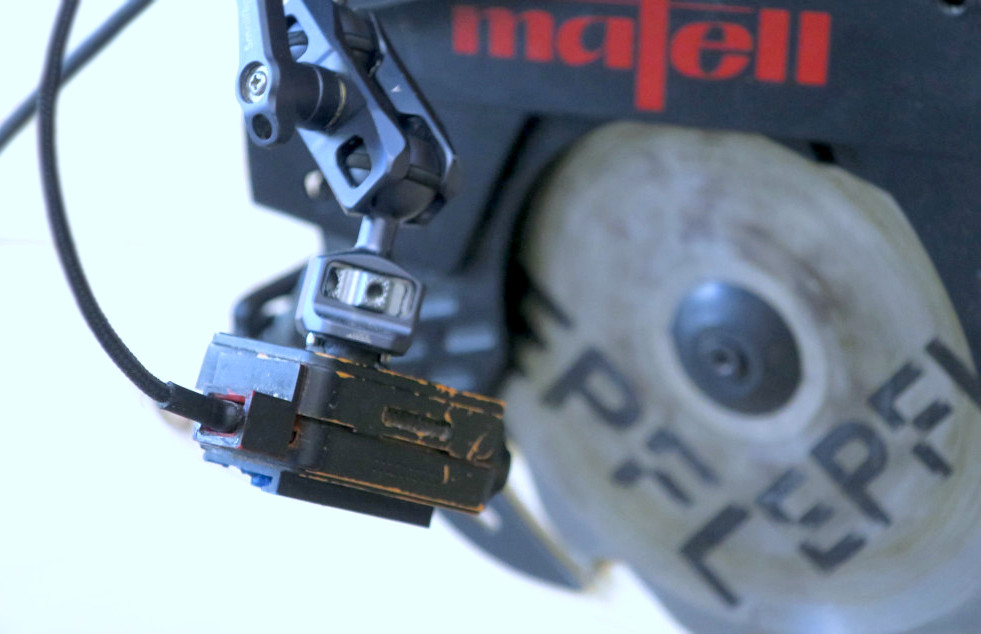

# Sensors

AC functions on a unique simple [moncoular camera](https://en.wikipedia.org/wiki/Monocular).

We decided to take up the challange to build the entire sensing system to boost the accessibility and the portability of the sensing system. Through the raster feed from the camera, AC is capable of providing all the computed information necessary for the fabrication. Plus, it is compact, lightweight and easy to install on any tool.
Finally, we believe that this can ensure a better future-proofing of any AR system.

/// html | div[style='float: left; width: 60%;']

{width="600" class="rounded-corners"}

///

/// html | div[style='float: right;width: 38%;']

The camera is installed on the tool itself with a locline and an articulated arm. This ensures to follows the tool movements and adapt the camera's view for each tool. This is a key feature to ensure that the tool head can be robustly tracked while detecting also the background features.

///

/// html | div[style='clear: both;']
///

For the AC prototype we integrated a monocular camera specifically developed for drone applications: [RunCam 2 4K](https://shop.runcam.com/runcam2-4k-edition/)[^1]. Here are the features of the camera we were interested in given the constraints during the fabrication. If you pick another camera we recommend you to pick one with similar specifics:

`Resolution (HD)`
:   The hgiher the resolution the more refined and accurate your computed information will be. Nonetheless, the higher the resolution the more computational power you will need to process the feed. We recommend a resolution of 1280x720 pixels.

`Frame rate (30 fps)`
:   As long as it does not drop below ~23 fps human eye cannot catch the difference. Nevertheless, this value important to have a smooth tracking and a reactive system.

`Large field of view (170°)`
:   A large fish-eye lens is recommended to have a large field of view. This is important to have a better understanding of the environment and to have a better tracking of the tool at the same time. The larger the view the more information e.g., pixels, to work with.

`Low weight (49g)`
:   The lighter the camera the less it will impact the tool balance and the less it will be a burden for the user of course.

`Shock and vibration resistant`
:   The tool is a vibrating machine and the camera will be exposed to a lot of vibrations. We found monocular sensors designed for drones to be the most adapted to this scenario.

`Capture distance`
:   This is a key feature that monocular camera offers: they are able to capture information about both close and far subjects at once. Range finding or laser-based systems although providing distance information, often struggle to provide information about close subjects and their capture distance is very high.

## Calibration

No matter the monocular camera you choose, you will need to calibrate it. A calibration is a process to determine the intrinsic and extrinsic parameters of the camera and it undistort the image feed.
This is a fundamental step to ensure the accuracy of the system. The better the calibration, the better the precision you will get from the AR system.

Before you start print this [chessboard](../assets/images/Checkerboard-A3-20mm-19x13.pdf) and follow the instructions below.

=== ":fontawesome-solid-briefcase:&nbsp;&nbsp; Wearable"

    You can move forward with the calibration and do it once the AC executable is running. Just follow the instructions in the [camera calibration section](augmented-woodworking/camera-calibration.md#how-to-calibrate-the-camera).

=== ":fontawesome-solid-laptop-code:&nbsp;&nbsp; Laptop"

    Download our python-made calibration tool from:

    ``` bash
    git clone https://github.com/ibois-epfl/rgb-camera-calibration.git
    ```

    Install opencv and capture all the images needed for the calibration:

    ``` bash
    pip install opencv-python
    cd rgb-camera-calibration
    python ./capture_img.py -I 0
    ```

    Then run the calibration:

    ``` bash
    python ./calibrate_camera.py -H 19 -V 13 -S 20
    ```

    Now save the values of the output `camera_calibration.json` in the AC format.

AC reads and saves the calibration in a `.yml` file. Here is an example of the calibration file.

``` yml title="assets/tslam/calibration_orange_A_1280_720_000B.yml"
--8<-- "assets/tslam/calibration_orange_A_1280_720_000B.yml"
```

The calibration file can be found and set manually from the `config.ini` file.

``` ini title="assets/default_config.ini" hl_lines="9"
--8<-- "assets/default_config.ini"
```

<!-- TODO: update -->
## Components list

!!! print-parts "Parts"

    Here's the list of the parts you will need to obtain or realize:

    - [x] &nbsp;&nbsp; RunCam 2 4K
    - [x] &nbsp;&nbsp; USB 2.0 cable (length: 1.5m)
    - [x] &nbsp;&nbsp; Articulated camera arm 1/4" screw
    - [x] &nbsp;&nbsp; Metal locline (1/4" - passage 6 mm)
    - [x] &nbsp;&nbsp; Locline-1/4" adapter

[^1]: the camera is discontinued since 2024.