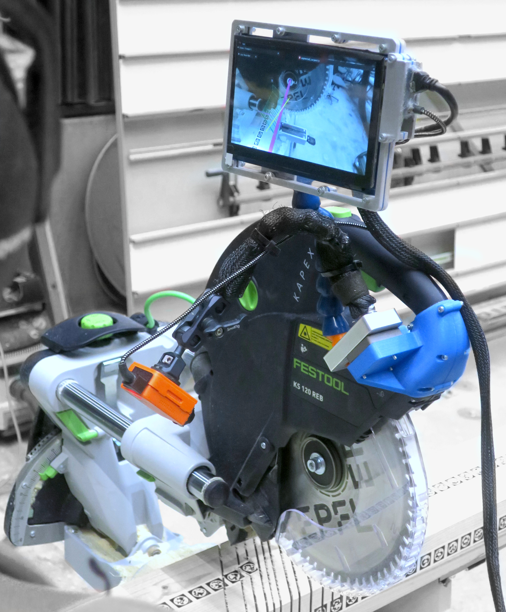
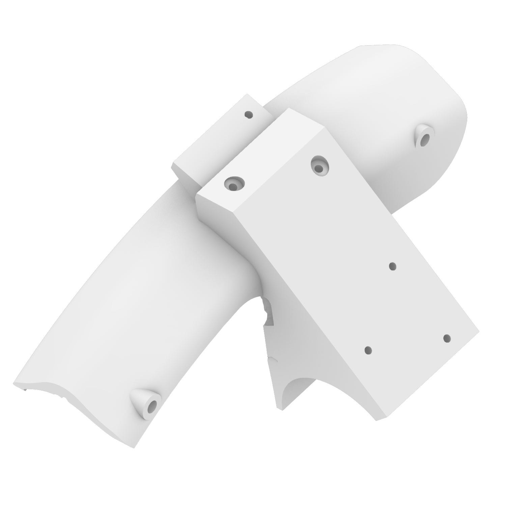

# Woodworking tools

/// html | div[style='float: left; width: 52%;']

{width="600" class="rounded-corners"}

///

/// html | div[style='float: right;width: 45%;']

AC is designed to seamlessly integrate with virtually any woodworking tool, new or old, provided you can:

- [x] securely mount the AC camera and display unit onto the tool itself
- [x] having a 3D model digital twin of the tool head you want to use

For the first one we provide a set of 3D printable mounts that you can download and print.

For the second one, you can find a list of the available toolheads [here](https://zenodo.org/records/12578820) that we already have in our database.

If you want to add your own 3d-printable mount or tool head model and share it with the community, follow the instructions in the section [contributing](../contributing/index.md).

///

/// html | div[style='clear: both;']
///

## Available Toolheads

<!-- TODO: add rotating svg of the toolhead -->

The following is a list of the available toolheads that are already integrated into the AC system. You will need to use or acquire the corresponding physical toolhead to use the AC system.

The Zenodo repository containing the dataset is [here](https://zenodo.org/records/12578820).

<!-- TODO: add icons for the type of tool -->

{{ run_python_script('docs/scripts/get_zenodo_toolheads.py') }}

!!! tip "Want to add a new toolhead?"
    If you want to add your own toolhead to the AC system, follow the instructions in the section [contributing](../contributing/index.md).

!!! note "Toolhead integration"
    If you want to know more about the details of the integration and how toolhead are managed in the AC system, you can read the [developer guide](../developer-guide/toolheads.md).

## Available 3D mounts

{width="200"} {width="200"} {width="200"} {width="200"} {width="200"} {width="200"} {width="200"} {width="200"} {width="200"} {width="200"}

Each mount is designed with a flexible integration mechanism, allowing for the attachment of various clipping solutions. Our reference implementation utilizes magnetic clips and a loc-line arm to ensure secure, tool-safe mounting of the sensors and interfaces and easy removal. However, the design files allow users to incorporate their preferred fastening methods—ranging from simple clips to more complex spring-loaded solutions—enabling adaptation to a broad range of tool geometries.
 
- Identify the corresponding mount file that matches your tool brand and model.
- Download and 3D print the STL file(s).
- Integrate your desired clipping mechanism.
- Attach the completed mount to your woodworking tool.

The Zenodo repository containing the dataset is [here](https://zenodo.org/records/14531724).

For convinience, here is a list of the available mounts regrouped by brands:

{{ run_python_script('docs/scripts/get_zenodo_mounts.py') }}

!!! tip "Want to add a new mount?"
    If you want to add your own toolhead to the AC system, follow the instructions in the section [contributing](../contributing/index.md).

<!-- TODO: add example and images on how to integrate our prototype with the loc line and the magnet -->

<!-- TODO: update -->
## Components list

!!! print-parts "Parts"

    Here's the list of the parts you will need to obtain or realize for this section:

    - [x] &nbsp;&nbsp; Machines with available mounts
    - [x] &nbsp;&nbsp; *3D print the downloaded mounts*
    - [x] &nbsp;&nbsp; Tool heads present in the model database