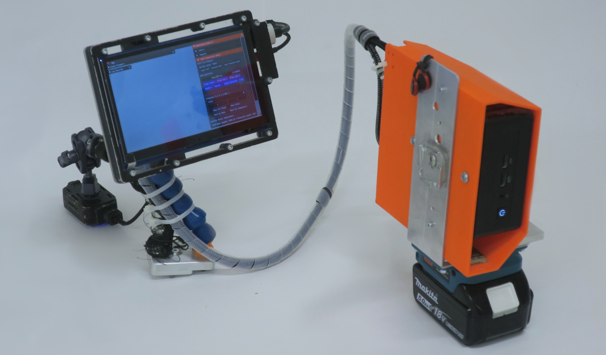

AC needs just a simple x64 machine running on Ubuntu 22.04 LTS an interface and a monocular camera. It does not exploit GPU acceleration and can run on a laptop, a portable computing unit (e.g. [NUC](https://en.wikipedia.org/wiki/Next_Unit_of_Computing)) or a desktop.

{width="900"}


For a quick start, you can use use your laptop. If you want to build on a touch screen, you can use the WaveShare WS170120 and follow the instructions below:

=== "Touch screen"

    If you use a touch screen be sure to set this option when configuring the build:

    ``` c++
    cmake -S . -B build -DDEPLOY_ON_TOUCH=ON
    ```

    You can use the WaveShare WS170120 and follow the instructions below:

    To config the touch screen on the pc follow [these steps first](https://www.waveshare.com/wiki/7inch_HDMI_LCD). Be sure to switch the display on, plug the mini-USB and finally plug the HDMI cable.

    Set the display properties in the `config.ini` properties (to find them run the commands `xinput`  for the name and `xrandr` for the connection type).

    The following specs works on the X11 display server also, but you can use any other touch screen, just make sure to set the correct specs in the `config.ini` file:

    ```c++ title="config.ini"
    [MonitorSpecs]
    monitor_name = WaveShare WS170120
    monitor_link_t = HDMI
    monitor_resolution = 1280 x 720
    ```

    !!! warning

        Wayland display and touchscreen are not compatible yet as the touchscreen register for the main display and not the small display.

        ```c++ title="config.ini"
        [MonitorSpecs]
        LinkMode = XWAYLAND1
        Name = Virtual core pointer
        Resolution = 1280 x 720
        ```

=== "Laptop"

    For a quick test or development you can use a laptop and the webcam. Just adjust later the CMake config option.

    ``` c++
    cmake -S . -B build -DDEPLOY_ON_TOUCH=OFF
    ```