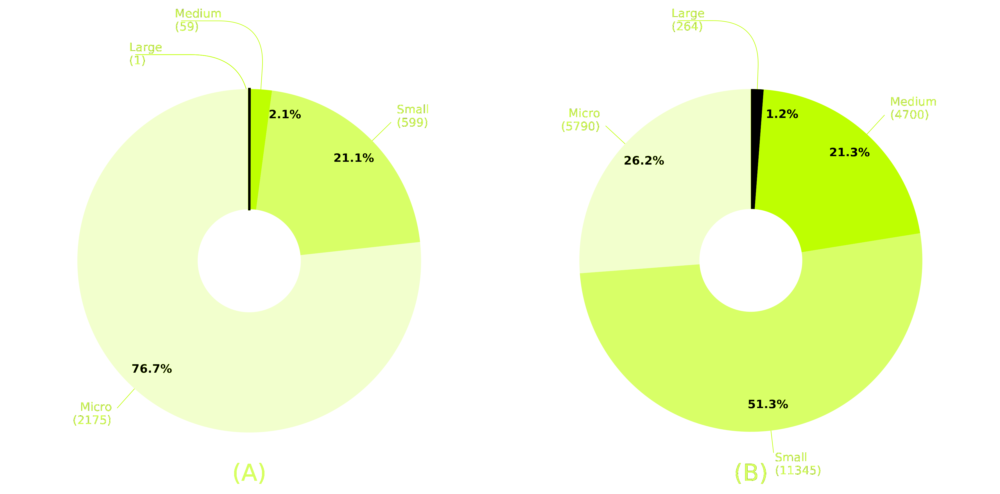
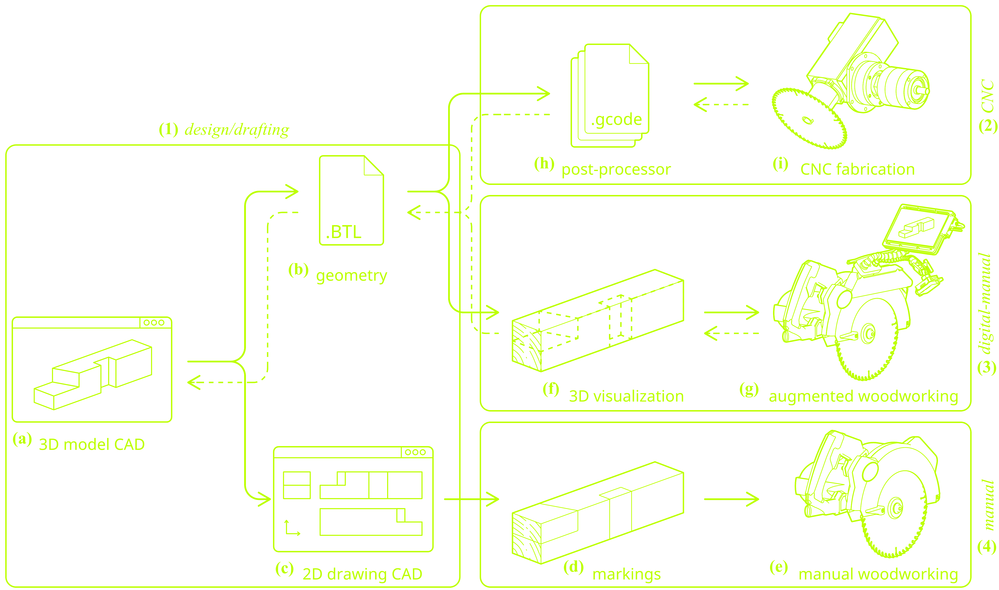

#

## Timber Construction Landscape

The sustainability of timber construction depends not only on material selection but also on efficient, adaptable, and locally responsive production processes. Effective use of digital fabrication enhances timber's ecological advantages, yet the prevalent reliance on centralized, high-tech manufacturing infrastructures remains a limitation.
Leading companies offer advanced CNC machining centers for linear and surface elements, featuring automated cutting, drilling, milling, and profiling, significantly improving production speed and precision. Despite their capabilities, these systems typically favor large-scale, standardized production, making customization or small-batch manufacturing challenging. High investment costs, substantial maintenance requirements, workflow disruptions, and technical complexity further restrict their use to well-funded entities.
In Switzerland, SMEs dominate the timber construction industry, comprising 99.9% of companies and employing 98.6% of the workforce[^1]. This trend extends across the broader construction sector, where SMEs account for the majority of businesses and employment opportunities[^1].
Promoting accessible and flexible digital fabrication technologies can empower SMEs and larger firms alike, significantly expanding sustainable timber construction's economic and ecological benefits. Democratizing digital fabrication could distribute knowledge, skills, and production capabilities more evenly, enhancing industry resilience, optimizing logistics, and encouraging widespread adoption of shared digital fabrication resources.

<figcaption style="color: #666; font-size: 0.8em;">(A) Number of timber companies and (B) number of employees by size in the Swiss timber construction sector, categorized by company size in 2022. Micro (1--9 employees), small (10--49), and medium (50--249) companies, black reports the large companies exceeding 250 employees.</figcaption>

## Research in Timber Robotic Construction

Current research in timber robotic construction primarily focuses on achieving full automation and replicating complex designs difficult to realize through traditional methods. However, significant initial investment and maintenance costs limit these advancements to larger companies, disadvantaging smaller enterprises. Emphasis is shifting towards adaptability and user-friendly interfaces through Human-Robot Collaboration (HRC), aiming to integrate human expertise within robotic workflows. Despite valuable ergonomic and interface improvements, widespread adoption remains hindered by expensive robotic infrastructure and proprietary firmware constraints. Additionally, reliance on technology-intensive solutions faces challenges due to semiconductor and material shortages, prompting the question of whether digital fabrication should expand to foster more inclusive, flexible, and accessible technologies.

## Digitalization of Manual Tasks

Digitizing manual tasks represents a viable strategy for broadening digital timber fabrication accessibility. The human workforce remains central to timber construction but increasingly disconnected from digital advancements in Architecture, Engineering, and Construction (AEC). Digital workflows integrating Building Information Modeling (BIM) facilitate seamless robotic and CNC manufacturing, whereas manual operations still rely on traditional 2D execution methods, interrupting digital continuity and risking future devaluation of human skills. By digitally visualizing, assisting, and monitoring manual tasks, the gap between traditional craftshumanship and modern technology can be bridged. This integration enhances precision, accuracy, and provides real-time assistance without disrupting established practices.

{ width=80%}
<figcaption style="color: #666; font-size: 0.8em;">The cyber approach of Augmented Carpentry is in the middle: profiting of human dexterity and digital logics of CNC machines.</figcaption>

## Augmented Workspace

Bridging manual labor and digital fabrication in timber construction can effectively occur through retrofitting, preserving existing workflows while selectively integrating digital enhancements. By augmenting conventional woodworking tools with sensors, microcontrollers, and open-source software, workers benefit from precise, real-time data without substantial infrastructure overhaul. This approach extends digital precision throughout manual fabrication stages, offering scalable, cost-effective, and resilient solutions. Particularly suited for portable woodworking equipment, retrofitting enables Small and Medium-sized Enterprises (SMEs) and larger companies to mitigate resource dependencies and sustainably adopt new fabrication practices. Recent advancements demonstrate the potential of augmented tools; however, significant technical and conceptual challenges remain to achieve broader deployment.

## `Augmented Carpentry`

All these considerations led to the development of the Augmented Carpentry system, a digital fabrication framework that aims to enhance manual woodworking processes by providing real-time feedback and assistance to operators. The system is designed to be user-friendly, cost-effective, and adaptable to various woodworking tasks, making it suitable for both small-scale and large-scale applications in the timber construction industry.
This can be achieved by embedding ordinary tools with sensors and replacing conventional 2D execution drawings, manual markings, and physical jigs in timber fabrication with a design-to-production digital visual guidance system. Powered by a low-cost monocular camera, familiar interfaces, and a single 3D execution model, the system is designed to integrate with standard woodworking power tools, thus enabling operators to perform manual tasks with digital assistance.
The produced augmented framework is named **Augmented Carpentry**. The development leading to this release is the result of a research carried on 4 years. The result is a functioning prototype that has been tested in the lab and in the field, and is now available for public use. The system is designed to be used with a variety of woodworking power tools, including chainsaws, circular saws, and routers. It is intended to be used by carpenters, builders, and other professionals in the construction industry and serve as a base for future research and development in the field of augmented reality in open-source digital fabrication.

[^1]: Reference: Number of timber construction employees by company size in Switzerland in 2022. Data from the [Federal Statistical Office STATENT 2022 (Vers. 22.08.2024)](https://www.bfs.admin.ch/bfs/fr/home/actualites/quoi-de-neuf.assetdetail.26665232.html), NOGA categories: 162303 (manufacture of other builders' carpentry and joinery of wood) and 439101 (carpentry, construction framing and joinery work).