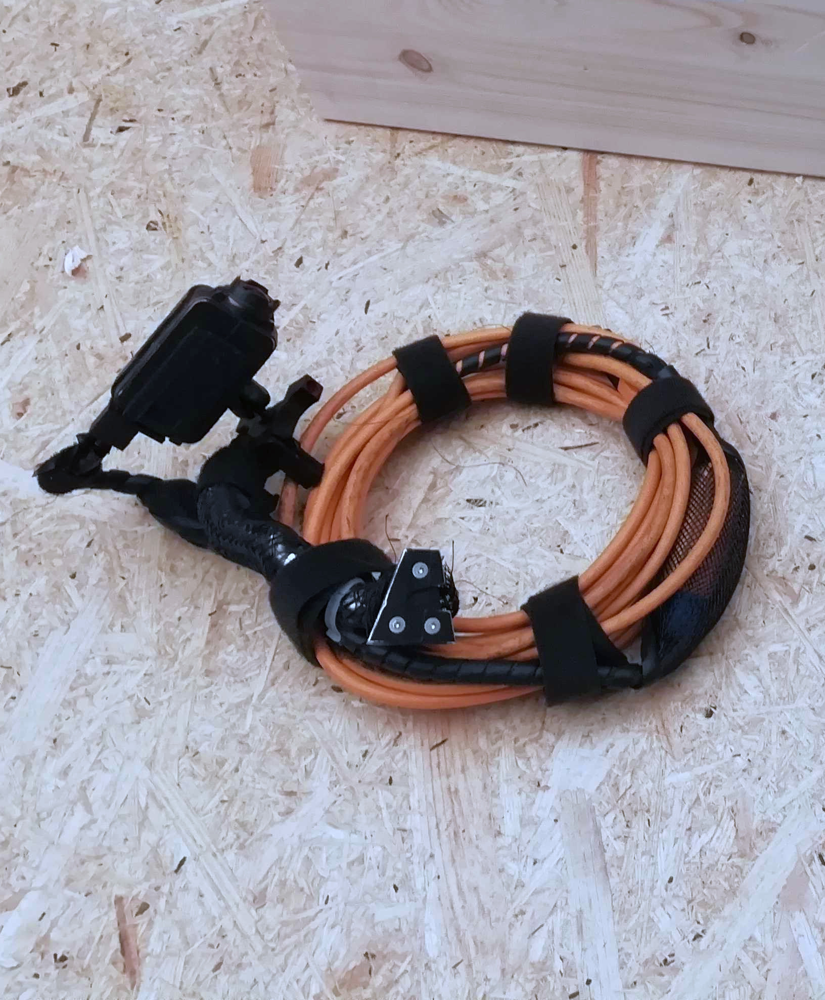

# Sensors

AC functions on a unique simple [moncoular camera](https://en.wikipedia.org/wiki/Monocular).

We decided to take up the challange to build the entire sensing system to boost the accessibility and the portability of the sensing system. Through the raster feed from the camera, AC is capable of providing all the computed information necessary for the fabrication.
Plus, we believe that this can ensure a better future-proofing of any AR system.

## Specifics

{width="300" align=left}

We developed AC to work on a monocular camera specifically developed for drone applications: [RunCam 2 4K](https://shop.runcam.com/runcam2-4k-edition/)[^1]. Here are the features of the camera we were interested in given the constraints during the fabrication. If you pick another camera we reccomand you to pick one with similar specifics:

- [x] **Resolution**: 4K :material-information-outline:{ title="the more pixels, i.e. infos, the better" }
- [x] **Frame rate**: 30 fps :material-information-outline:{ title="the more frames, the better" }
- [x] **Large field of view**: 170° :material-information-outline:{ title="the more view, i.e. infos, the better" }
- [x] **Low weight**: 49g :material-information-outline:{ title="the lighter, the better since this is mounted on the tool" }
- [x] **Shock and vibration resistant**: up to ~2.5g :material-information-outline:{ title="the more resistant, the better" }
- [x] **USB interface**: USB 2.0 :material-information-outline:{ title="the more common, the better" }

## Calibration

No matter the camera you choose, you will need to calibrate it. This is a fundamental step to ensure the accuracy of the system. The better the calibration, the better the precision you will get from the AR system.

Before you start print this [chessboard](assets/images/Checkerboard-A3-20mm-19x13.pdf) and follow the instructions below.

=== "Touch screen"

    You can move forward with the calibration and do it once the AC executable is running. Just follow the instructions in the [camera calibration section](augmented-woodworking/camera-calibration.md#how-to-calibrate-the-camera).

=== "Laptop"

    Download our python-made calibration tool from:

    ``` bash
    git clone https://github.com/ibois-epfl/rgb-camera-calibration.git
    ```

    Install opencv and capture all the images needed for the calibration:

    ``` bash
    pip install opencv-python
    cd rgb-camera-calibration
    python ./capture_img.py -I 0
    ```

    Then run the calibration:

    ``` bash
    python ./calibrate_camera.py -H 19 -V 13 -S 20
    ```

    Now save the values of the output `camera_calibration.json` in the AC format.

AC reads and saves the calibration in a `.yml` file. Here is an example of the calibration file.

``` yml title="assets/tslam/calibration_orange_A_1280_720_000B.yml"
--8<-- "assets/tslam/calibration_orange_A_1280_720_000B.yml"
```

The calibration file can be found and set manually from the `config.ini` file.

``` ini title="assets/default_config.ini" hl_lines="9"
--8<-- "assets/default_config.ini"
```


[^1]: the camera is discontinued since 2024.