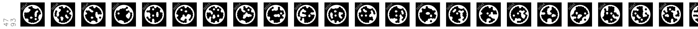

## Stickers

The last thing you need is a set of *STags*. These are the markers that help the camera understand its position and orientation to the timber beam. You can find them as 450 stripes for a total of 21149 tags are available in batches of 50 stripes with an A0 format, ready to print (better as stickers) and can [be downloaded here](https://zenodo.org/record/7738721/files/stag_stickers_ready.zip?download=1). They are made to be print as stickers, but if you want to generate your own you can find a [script here](https://github.com/ibois-epfl/TSlam/tree/main/stag_util).