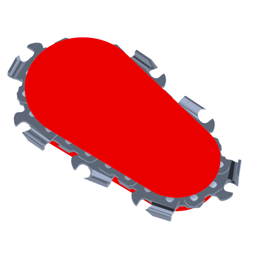

<!--
# Structure of the paper

- (0) Summary (MAX 50 words) - ANDREA
- (1) Statement of need (MAX 125 words) - ANDREA
- (2) Functionalities (MAX 100 words) - ANDREA
- (1.1) Layer-stack flow (MAX 150 words) - ANDREA
- (1.2) Geometry framework (MAX 200 words) - HONG-BIN
- (1.3) AR rendering (MAX 150 words) - HONG-BIN
- (1.4) Computed Feedback System (MAX 150 words) - ANDREA
- (2) Acknowledgements - ANDREA
- (3) References - ANDREA
-->

# Summary

<!-- this is a sort of abstract. (MAX 50 words) -->
<!-- { width=20% } -->

# Statement of need

<!--
aka "state-of-the-art". This is a context introduction and brief state-of-the-art. (MAX 125 words)
-->

# Functionalities

<!--
brief introduction to the general functioning and the following sections. (MAX 75 words)
It might include details that are no more mentioned in the following sections like:
- the hardware used (x64, monocular camera, etc.)
- ...
-->

## Layer-stack flow  <!-- 167/150 words -->

The layer stack is primarily responsible for managing the flow control of the AR engine. Designed as a modular system, each layer encapsulates the code for a specific domain of the AR application, such as camera processing, object tracking, UI, and rendering. The general order and expansion of these layers can be configured in the top-level main file `ACApp.cpp`.

Each layer in the stack inherits from a superclass interface defined in `Layer.h`, which includes event-like methods triggered at various points during frame processing (e.g., `OnFrameAwake()`, `OnFrameStart()`, etc). These methods are invoked by the main `Run()` function in the singleton application loop from `Application.h`. This design allows application tasks to be containerized and executed sequentially while facilitating data exchange between specific layers through the `AIAC_APP` macro, enabling the retrieval of any particular layer data. Exchange between layers can also take place in a more structured way with the integrated event system (`ApplicationEvent.h`), which is capable of queuing events from layers and trigger them in the next main loop.

{ width=60%}

## Geometry framework
The geometry framework provides a uniform infrastructure to handle all 3D objects present in the scene, including the CAD model, scanned models, and virtual instructions. This framework not only allows application layers to interact with the 3D object easily but is also tightly integrated with the rendering system and manages the OpenGL resources implicitly to ease the work for application layers.

The geometry is classified by the following primitive shapes: point, line, circle, cylinder, polyline, triangle, mesh, and text. Each primitive shape is a class (e.g. `GOPoint`, `GOLine`, `GOCircle`, etc) inheriting from the base class `GOPrimitive`, where GO stands for Geometry Object. The system also maintains a global table `GORegistry` to keep track of all the geometry objects. When a GO initializes, it registers itself in a global table with a unique UUID. As the table is exposed to the entire system, application layers can acquire specific objects through their UUIDs or iterate through all objects to perform operations.

## Computed Feedback System  <!-- 193/150 words -->

The `LayerFeedback.h` module handles the computation of all essential data required to deliver visual guidance to the user during the fabrication process. This system occupies one of the final positions in the stack, positioned just before the `LayerUI`. To compute feedback, information is primarily retrieved from two preceding layers: 

1. `LayerModel.h`: Contains the execution model and the geometries associated with the currently active hole or cut.
2. `LayerToolhead.h`: Provides similar information, but specific to the current toolhead attached to the tool.

Feedback is computed in tool-specific sets, categorized by tool families such as drilling (`HoldeFeedback.h`), circular cutting (`CutCircularSawFeedback.h`), and chainsaw cutting (`CutChainSawFeedback.h`). Each feedback category is inherits fnrom a interface class (`AIAC/Feedback/FabFeedback.h`), which provides top-level control functions such as `Update()`, `Activate()`, and `Deactivate()`. Each tool's visual guidance might consists of multiple visual cues, most of which are built on the template `FeedbackVisualizer.h`. These internal components (e.g. `CutBladeThicknessVisualizer.h` or `CutPlaneVisualizer.h`) manage their own geometric visual cues calculation and representation stored as graphic object (`GO`) instances in the belonging superclass member vector. Thus, visualization of these `GO` elements, hence of the feedback itself, can be selectively enabled or entirely toggled on/off using the `Activate()`/`Deactivate()` functions.

{ width=60%}

## AR rendering
The rendering system synthesizes the captured video and virtual objects, such as CAD models and feedback graphics, to create an AR view.

The rendering system is built using OpenGL, where the infrastructure is mainly defined in `Renderer.h`. When a GOPrimitive object is constructed or modified, a corresponding OpenGL instance is initialized. As OpenGL only renders points, lines, and meshes, the primitive shapes of circles and cylinders construct corresponding meshes implicitly. Additionally, the geometry system allows users to define the width of lines, while OpenGL's line rendering does not. Therefore, a mesh of a cylinder is created for rendering thick lines.

Text rendering is handled separately using `TextRenderer.h` since we intend to make the text always face the screen instead of floating in 3D space. To achieve this, a different shader is created to perform a unique projection method.

On each frame, the rendering layer (`LayerRendering.h`) takes the estimated camera position from the SLAM layer to calculate the projection matrix and iterates through the geometry table to render visible objects. While iterating, the system checks the type of shape and calls the corresponding function to render either text or non-text objects, additively depicting objects on the captured image, ultimately creating the AR view.

# Acknowledgements

<!-- list of contributors -->

# References

<!--
Citations to entries in paper.bib should be in
[rMarkdown](http://rmarkdown.rstudio.com/authoring_bibliographies_and_citations.html)
format.

If you want to cite a software repository URL (e.g. something on GitHub without a preferred
citation) then you can do it with the example BibTeX entry below for @fidgit.

For a quick reference, the following citation commands can be used:
- `@author:2001`  ->  "Author et al. (2001)"
- `[@author:2001]` -> "(Author et al., 2001)"
- `[@author1:2001; @author2:2001]` -> "(Author1 et al., 2001; Author2 et al., 2002)"
-->

