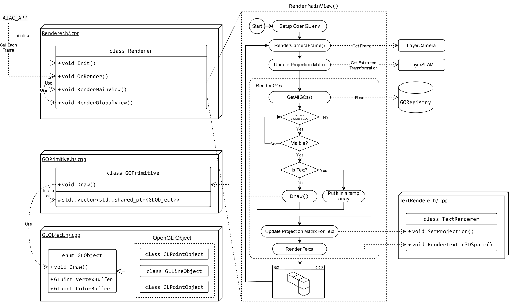

# Summary  <!-- 55/50 words -->

ACEngine is a lightweight and fast-developing UNIX C++ engine for prototyping AR applications leveraging bleeding-edge robotic vision research for digital fabrication. It features a modular layer-stack flow, a geometry framework for managing 3D objects, a computed feedback system for visual guidance, and an AR rendering system for synthesizing digital instructions into a simple monocular camera feed.

# Statement of need  <!-- 197/125 words -->

ACEngine (ACE) addresses critical limitations in existing augmented reality (AR) tools for digital fabrication. CompasXR [@compas-xr], the only open-source AR tool available in the digital fabrication field, provides a valuable common platform, particularly for assembly tasks. However, it currently lacks a streamlined integration pipeline for advanced robotic vision technologies due to its reliance on Unity [@unity] and the Windows operating system (OS). In the field of AR fabrication, developers from the current Incon.ai [@incon] represent the peak of AR engine innovation with robotic vision algorithm integration for digital fabrication in research [@sandy:2016; @sandy:2018; @mitterberger:2020], nevertheless, its codebase remains unavailable to the public.

AC aims to fill this gap by providing a lightweight, open-source, and UNIX-compatible C++ engine for AR applications in digital fabrication. Its software architecture is similar to existing free engines [@godot; @torque3d; @ezengine], yet it prioritizes rapid prototyping, flexibility, and customization for extended reality (XR) manufacturing using accessible sensors and hardware. Unlike feature-rich game engines with excessive functionalities or proprietary constraints [@unity; @unreal], ACE is lightweight, aided by the adoption of a bloat-free UI system [@dearimgui], and maintains full compatibility with Linux systems—crucial for integrating the latest open-source robotic vision technologies in AR manufacturing.

## Layer-stack flow  <!-- 198/150 words -->

The main AR engine is managed by a layer-stack flow. Designed as a modular system, each layer encapsulates the code for a specific domain of the AR application, such as camera processing, sensor's self-localization, object tracking, UI, and rendering. The general order and expansion of these layers can be configured in the top-level main file `ACApp.cpp`. This architecture provides flexibility to customize key AR features as needed, including integrating new sensors, modifying the rendering pipeline, or adapting camera pose estimation methods. For instance, users can implement pose estimation based on tags [@salinas:2019], features [@compos:2021], or hybrid [@settimi:2024] approaches as supported by the software out of the box.

Each layer in the stack inherits from a superclass interface defined in `Layer.h`, which includes event-like methods triggered at various points during frame processing (e.g., `OnFrameAwake()`, `OnFrameStart()`, etc). These methods are invoked by the main `Run()` function in the singleton application loop from `Application.h`. This design allows application tasks to be containerized and executed sequentially while facilitating data exchange between specific layers through the `AIAC_APP` macro, enabling the retrieval of any particular layer data. Exchange between layers can also take place in a more structured way with the integrated event system (`ApplicationEvent.h`), which is capable of queuing events from layers and trigger them in the next main loop.

{ width=60%}

## Geometry framework  <!-- 157/200 words -->

The geometry framework provides a unified infrastructure for handling all 3D objects in the scene, including CAD models, scanned models, and fabrication instructions. This framework enables easy interaction between application layers and 3D objects while being tightly integrated with the rendering system, which implicitly manages OpenGL resources, simplifying the workload for application layers.

The geometry is organized into the following primitive shapes: point, line, circle, cylinder, polyline, triangle, mesh, and text. Each of them is a class (e.g., `GOPoint`, `GOLine`, `GOCircle`, etc.) that inherits the base class `GOPrimitive`, where "GO" stands for Geometry Object. The base class manages general attributes and provides interfaces such as visibility and transformation, while the subclasses handle their specific data and functions.

Additionally, the system maintains a global registry, `GORegistry`, to keep track of all GOs. To add a GO to the scene, the static function `Add()` of the desired shape must be called, e.g., GOPoint::Add() or GOLine::Add(). Upon initialization, each GO acquires a unique UUID and registers itself in the global hash table. Since this table is accessible throughout the system, application layers can retrieve specific objects by their UUIDs or iterate through all objects to perform operations.

{ width=100%}

## Computed Feedback System  <!-- 170/150 words -->

The `LayerFeedback.h` module manages the computation of all essential data required to provide visual guidance to users during the fabrication process. Feedback computation primarily relies on data retrieved from two preceding layers:

1. `LayerModel.h`: contains the execution model and geometries associated with the currently active hole or cut.
2. `LayerToolhead.h`: provides similar information, but specific to the toolhead currently attached to the tool.

Feedback is categorized based on similar operations, such as drilling (`HoleFeedback.h`), circular cutting (`CutCircularSawFeedback.h`), and chainsaw cutting (`CutChainSawFeedback.h`). Each feedback category inherits from an interface class (`AIAC/Feedback/FabFeedback.h`), which defines high-level control functions like `Update()`, `Activate()`, and `Deactivate()`.

The visual guidance for each tool may consist of multiple visual cues, most of which are implemented using the template `FeedbackVisualizer.h`. These internal components (e.g., `CutBladeThicknessVisualizer.h` or `CutPlaneVisualizer.h`) handle their own geometric visual cue calculations and store representations as `GO` instances in a member vector of the corresponding superclass. Visualization of these `GO` elements, and thus the feedback itself, can be selectively enabled or entirely toggled on/off using the `Activate()` and `Deactivate()` functions.

{ width=100%}

## AR rendering  <!-- 155/150 words -->

The rendering system manages two viewports: the main AR view and the 3D viewport. The AR view combines captured images with virtual objects, such as CAD models and feedback graphics, to provide clear and intuitive instructions. The 3D viewport serves as an interface for navigating the entire scene, enabling users to easily inspect different components. The system consists of the following key components:

1. `Renderer.h`: Defines the core logic of the rendering pipeline and manages essential attributes.
2. `Viewport.h`: Handles the sub-frame buffer. The renderer calls `Activate()` to switch the buffer for rendering.
3. `GLObject.h`: Helps GO manage OpenGL resources, allocating memory and buffering data for rendering. Each GO may contain one or multiple GLObjects stored in a list. By invoking Draw(), the content is rendered to the currently active frame buffer.

The `Renderer::OnRender()` function is executed after all layers are processed. Within this function:

1. `RenderMainView()` renders the main AR view by calculating the projection matrix using the estimated position from `LayerSLAM` and overlays all geometry from the `GORegistry` onto the captured image.
2. `RenderGlobalView()` switches the frame buffer to the 3D viewport and renders the geometry with a projection based on the user's navigation.

{ width=100%}

# Acknowledgements  <!-- 45 words -->

We would like to thank all the contributors to the ACEngine project, including the developers, researchers, and users who have provided valuable feedback and suggestions. Special thanks to the GIS and the Center for Imaging EPFL groups, for their support throughout the development process.

# References
