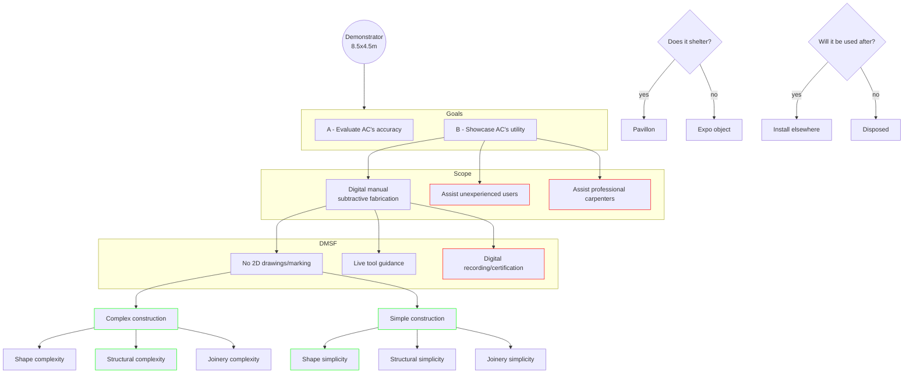

```mermaid
flowchart TB

classDef risk stroke:#f00
classDef active stroke:#0f0
classDef passive stroke:#f00

%% NOTES: the missing piecce is that we want to produce a piece of design. Ma perche ci prendiamo la test con questa cosa? Perchè in piu del NO-2D vogliamo dimostrare the con questo metodo tutti possono produrre un design computazionale in legno e avere i mezzi per realizzarlo--> che cosa realizzare?
%% ANONIMITY: altrimenti rischiamo di essere accusati di essere un progetto di design e non per fare showcase della ricerca/tecnologia--> come fare anonimo senza noioso?

Demo((Demonstrator
     8.5x4.5m))

Demo --> Goals

%% the goal is to showcase and demonstrate a technology in a demonstrator
subgraph Goals
    ShowTechAccuracy[A - Evaluate AC's accuracy]
    ShowTechUtility[B - Showcase AC's utility]
end

subgraph Scope
    AllDigM[Digital manual 
            subtractive fabrication]
    AssistN[Assist unexperienced users]:::risk
    AssistP[Assist professional carpenters]:::risk

    ShowTechUtility --> AllDigM
    ShowTechUtility --> AssistN
    ShowTechUtility --> AssistP
end

%% digital manual fabrication components
subgraph DMSF
    AllDigM_no2d[No 2D drawings/marking]
    AllDigM_VFeedback[Live tool guidance]
    AllDigM_DCert[Digital recording/certification]:::risk

    AllDigM --> AllDigM_no2d
    AllDigM --> AllDigM_VFeedback
    AllDigM --> AllDigM_DCert
end


%% ---------------------------------------------------------
%% COMPLEX VS SIMPLE CONSTRUCTION
%% this is where it makes it more clear that not having 2D-3D drawings is
%% a real advantage
Comp[Complex construction]:::active
ShapeComp[Shape complexity]
StrComp[Structural complexity]:::active
JoinComp[Joinery complexity]
Comp --> ShapeComp
Comp --> StrComp
Comp --> JoinComp
%% we belive that simple construction can benefit for not having to
%% 2d draw/mark on timber pieces -- one goal is to show that this can be
%% used in ordinary situations.
Simp[Simple construction]:::active
ShapeSimp[Shape simplicity]:::active
StrSimp[Structural simplicity]
JoinSimp[Joinery simplicity]
Simp --> ShapeSimp
Simp --> StrSimp
Simp --> JoinSimp

AllDigM_no2d --> Comp
AllDigM_no2d --> Simp


%% ---------------------------------------------------------
%% questions
ST_func{Does it shelter?}
ST_func -- yes --> Pav[Pavillon]
ST_func -- no --> Expo[Expo object]

ST_use{Will it be used after?}
ST_use -- yes --> UsedAfter[Install elsewhere]
ST_use -- no --> NotUsedAfter[Disposed]

```